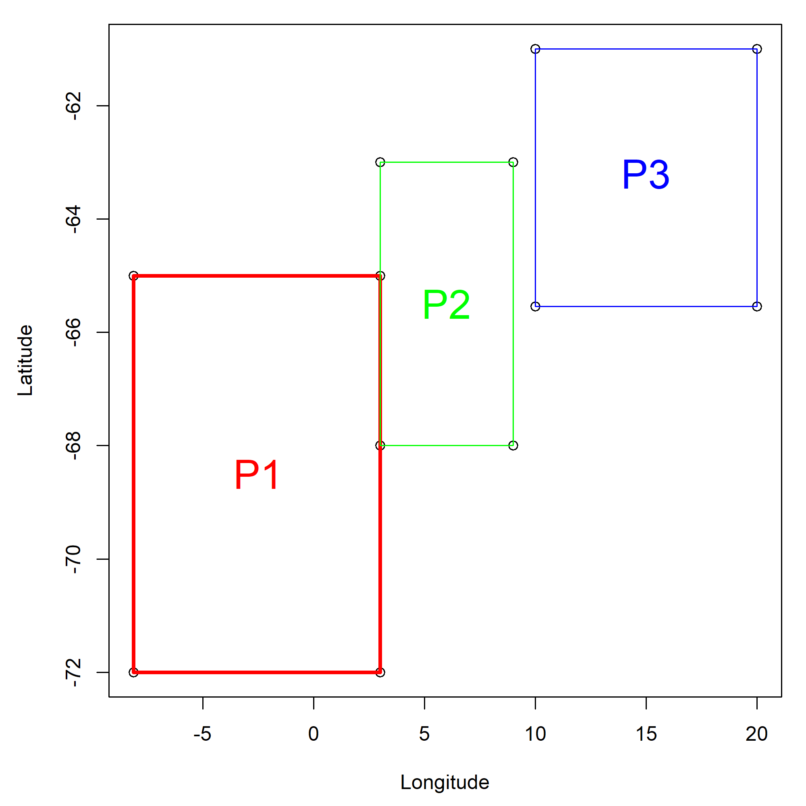
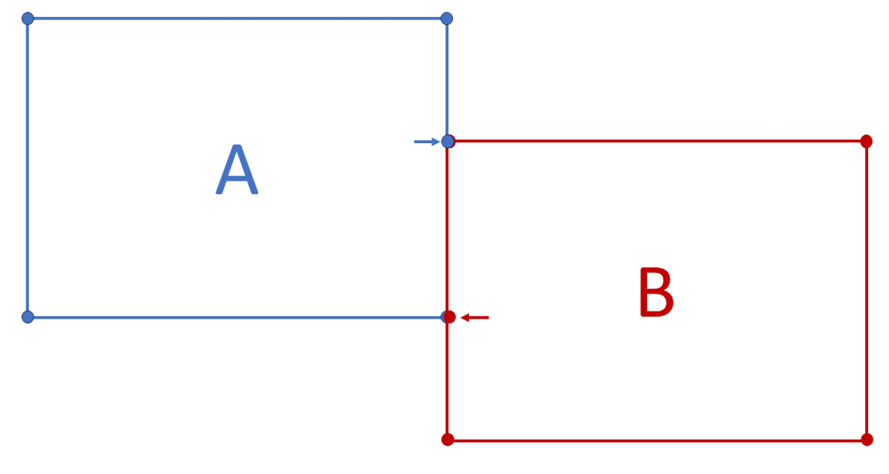
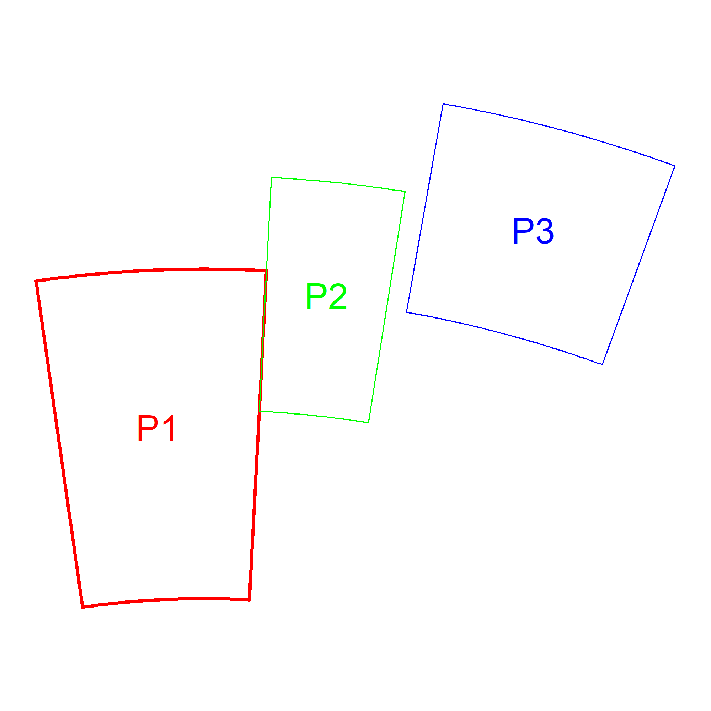
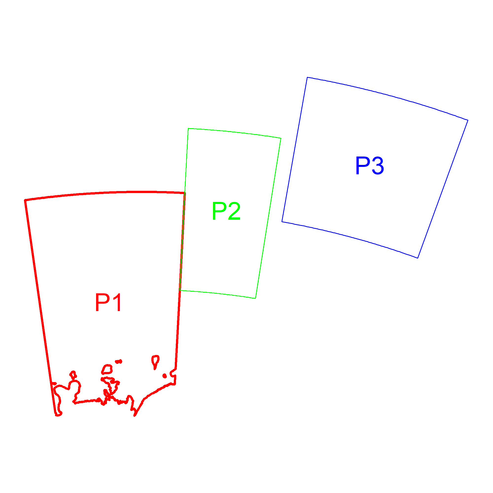
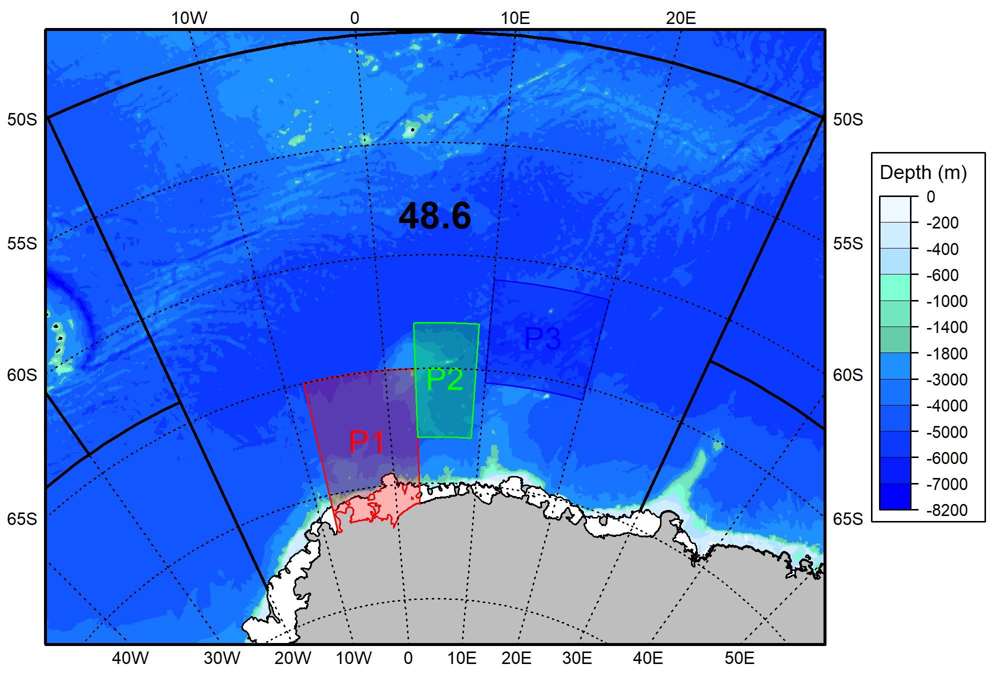

<!-- README.md is generated from README.Rmd. Please edit that file -->

<center>

# Building Polygons

</center>

<center>

### Overview

</center>

This tutorial provides step-by-step instructions to build polygons while
following the Geospatial Rules. Polygons may be used to represent areas
(*e.g.*, Research Blocks or Marine Protected Areas) or to subset data
spatially (*e.g.*, finding fishing locations that fall within a chosen
area). While details may differ, this workflow corresponds to the
backbone of the workflow used by the Secretariat to build and maintain
CCAMLR spatial objects.

------------------------------------------------------------------------

### Step 1 - Build a table of vertices

Download the [Blank Polygon
Form](https://github.com/ccamlr/geospatial_operations/tree/main/Scripts/Polygons),
which is a .csv file with three columns (*Name*, *Latitude* and
*Longitude*). While the name of these columns can be changed, they must
be in that order. Fill the form, one row per vertex, giving coordinates
with at least five decimal places, and clockwise. Repeat the polygon
name for each of its vertices. As an example, here is a table of
vertices for 3 polygons in Subarea 48.6 (the corresponding csv file is
[My_Polygons_Form.csv](https://github.com/ccamlr/geospatial_operations/tree/main/Scripts/Polygons)):

| Name |  Latitude | Longitude |
|:-----|----------:|----------:|
| P1   | -65.00000 |  -8.12345 |
| P1   | -65.00000 |   3.00000 |
| P1   | -72.00000 |   3.00000 |
| P1   | -72.00000 |  -8.12345 |
| P2   | -63.00000 |   3.00000 |
| P2   | -63.00000 |   9.00000 |
| P2   | -68.00000 |   9.00000 |
| P2   | -68.00000 |   3.00000 |
| P3   | -61.00000 |  10.00000 |
| P3   | -61.00000 |  20.00000 |
| P3   | -65.54321 |  20.00000 |
| P3   | -65.54321 |  10.00000 |

<br>

Plotting these coordinates as they are, and connecting them with lines
for each polygon, yields:

``` r
#Read the file
MyVertices=read.csv(paste0(Pth,"Scripts/Polygons/My_Polygons_Form.csv"))

#Plot
png(filename=paste0(Pth,'Figures/MyPolygons0.png'),width=2000,height=2000,res=300)
par(mai=c(0.9,0.9,0.2,0.2)) #margins

plot(MyVertices$Longitude,MyVertices$Latitude,xlab="Longitude",ylab="Latitude")

lines(MyVertices$Longitude[c(1:4,1)],MyVertices$Latitude[c(1:4,1)],col="red",lwd=3)
lines(MyVertices$Longitude[c(5:8,5)],MyVertices$Latitude[c(5:8,5)],col="green")
lines(MyVertices$Longitude[c(9:12,9)],MyVertices$Latitude[c(9:12,9)],col="blue")

text(-2.5,-68.5,"P1",col="red",cex=2)
text(6,-65.5,"P2",col="green",cex=2)
text(15,-63.2,"P3",col="blue",cex=2)

dev.off()
#> png 
#>   2
```

<div class="figure" style="text-align: center">


<p class="caption">

Figure 1. Polygon coordinates as they are given in the
‘My_Polygons_Form.csv’ file.
</p>

</div>

<br>

As seen above, polygons P1 and P2 share a boundary. Following Geospatial
Rule 4, vertices must be added where polygons meet as shown below:

<div class="figure" style="text-align: center">


<p class="caption">

Figure 2. Polygons A and B are each defined by four vertices and an
additional vertex at the extremity of their shared edge (arrow). Figure
taken from WG-FSA-2023 Fig. 1.
</p>

</div>

<br>

Vertices were added to the table, as indicated below:

| Name |  Latitude | Longitude |           |
|:-----|----------:|----------:|:----------|
| P1   | -65.00000 |  -8.12345 |           |
| P1   | -65.00000 |   3.00000 |           |
| P1   | -68.00000 |   3.00000 | \<= Added |
| P1   | -72.00000 |   3.00000 |           |
| P1   | -72.00000 |  -8.12345 |           |
| P2   | -63.00000 |   3.00000 |           |
| P2   | -63.00000 |   9.00000 |           |
| P2   | -68.00000 |   9.00000 |           |
| P2   | -68.00000 |   3.00000 |           |
| P2   | -65.00000 |   3.00000 | \<= Added |
| P3   | -61.00000 |  10.00000 |           |
| P3   | -61.00000 |  20.00000 |           |
| P3   | -65.54321 |  20.00000 |           |
| P3   | -65.54321 |  10.00000 |           |

------------------------------------------------------------------------

### Step 2 - Build polygons

Now that the table of vertices is complete, the
[create_Polys()](https://github.com/ccamlr/CCAMLRGIS#create-polygons)
function of the CCAMLRGIS R package can be used to create densified and
projected polygons:

``` r
library(CCAMLRGIS)

MyPolygons=create_Polys(MyVertices)

#Plot
png(filename=paste0(Pth,'Figures/MyPolygons1.png'),width=2000,height=2000,res=300)
par(mai=rep(0.1,4)) #margins

plot(st_geometry(MyPolygons)) #Plot all polygons to set axes limits
plot(st_geometry(MyPolygons[MyPolygons$ID=="P1",]),border="red",lwd=3,add=T)
plot(st_geometry(MyPolygons[MyPolygons$ID=="P2",]),border="green",add=T)
plot(st_geometry(MyPolygons[MyPolygons$ID=="P3",]),border="blue",add=T)

text(MyPolygons$Labx,MyPolygons$Laby,MyPolygons$ID,col=c("red","green","blue"),cex=2)

dev.off()
#> png 
#>   2
```

<div class="figure" style="text-align: center">


<p class="caption">

Figure 3. Densified and projected polygons.
</p>

</div>

------------------------------------------------------------------------

### Step 3 - Clip polygons to all coastlines

To clip polygons to the coastlines (*i.e.*, remove the land portion of a
polygon to keep only its marine portion), the following script is used:

``` r
#Load Coastline
Coast=load_Coastline()

#Isolate land and merge (union) polygons into one:
Land=Coast[Coast$surface=="Land",]
Land=st_union(Land)

#Clip polygons
MyPolygons=suppressWarnings( st_difference(MyPolygons,Land) )

#Plot
png(filename=paste0(Pth,'Figures/MyPolygons2.png'),width=2000,height=2000,res=300)
par(mai=rep(0.1,4)) #margins

plot(st_geometry(MyPolygons)) #Plot all polygons to set axes limits
plot(st_geometry(MyPolygons[MyPolygons$ID=="P1",]),border="red",lwd=3,add=T)
plot(st_geometry(MyPolygons[MyPolygons$ID=="P2",]),border="green",add=T)
plot(st_geometry(MyPolygons[MyPolygons$ID=="P3",]),border="blue",add=T)

text(MyPolygons$Labx,MyPolygons$Laby,MyPolygons$ID,col=c("red","green","blue"),cex=2)

dev.off()
#> png 
#>   2
```

<div class="figure" style="text-align: center">


<p class="caption">

Figure 4. Polygons clipped to the coastline.
</p>

</div>

------------------------------------------------------------------------

### Step 4 - Update Metadata

The spatial object that was created (*MyPolygons*) contains metadata in
addition to the vertices of polygons (which are listed within the
*geometry* column):

| ID  |  AreaKm2 |      Labx |    Laby | geometry                     |
|:----|---------:|----------:|--------:|:-----------------------------|
| P1  | 355139.0 | -107352.1 | 2399447 | POLYGON ((-390093.2 2740938… |
| P2  | 154794.3 |  284451.7 | 2706377 | POLYGON ((161468.4 2981429,… |
| P3  | 254156.2 |  765798.0 | 2857997 | POLYGON ((561536.3 3152447,… |

Each row corresponds to a polygon, the columns are:

- ID: Polygon identifier, taken from the “Name” column in the table of
  vertices,

- AreaKm2: Polygon area in square kilometers, calculated during
  creation,

- Labx and Laby: Location of polygon centers, calculated during creation
  and used to label polygons,

- geometry: POLYGON list of projected vertices (*i.e.*, the shape and
  location of polygons)

Since polygons were clipped to the coastline after their creation, their
areas and centers must be recalculated. Also, at this point, additional
information may be added in the spatial object such as a reference to
the paper describing these polygons:

``` r
#Update Areas
Ar=round(st_area(MyPolygons)/1000000,1)
MyPolygons$AreaKm2=as.numeric(Ar)
#Update labels locations
labs=st_coordinates(st_centroid(st_geometry(MyPolygons)))
MyPolygons$Labx=labs[,1]
MyPolygons$Laby=labs[,2]
#Add Reference
MyPolygons$Reference="WG-SAM-2023/xx Fig. z"
```

| ID | AreaKm2 | Labx | Laby | geometry | Reference |
|:---|---:|---:|---:|:---|:---|
| P1 | 317949.4 | -109064.8 | 2439867 | POLYGON ((-390093.2 2740938… | WG-SAM-2023/xx Fig. z |
| P2 | 154794.3 | 284451.7 | 2706377 | POLYGON ((161468.4 2981429,… | WG-SAM-2023/xx Fig. z |
| P3 | 254156.2 | 765798.0 | 2857997 | POLYGON ((561536.3 3152447,… | WG-SAM-2023/xx Fig. z |

------------------------------------------------------------------------

### Step 5 - Export spatial object

The polygons are now completed and may be exported:

``` r
#Export
st_write(MyPolygons,paste0(Pth,"Scripts/Polygons/Completed_Polygons.gpkg"),quiet=T,append=F,delete_dsn=T)
```

The Geopackage generated (*.gpkg* file) may then be shared and submitted
along with the corresponding proposal.

------------------------------------------------------------------------

### Step 6 - Plot map

The script below provides some elements to produce a map. Other examples
are given
[here](https://github.com/ccamlr/CCAMLRGIS/blob/master/Basemaps/Basemaps.md#basemaps).

``` r
library(CCAMLRGIS)
library(terra)
library(png)
#Download bathymetry:
Bathy=load_Bathy(LocalFile=F,Res=5000) #Once downloaded, re-use it. See help(load_Bathy) for details
# Bathy=SmallBathy() #Use this instead for testing purposes first

#Load Coastline
Coast=load_Coastline()

#Load ASDs
ASDs=load_ASDs()

#Rotate objects
Lonzero=5 #This longitude will point up
R_bathy=Rotate_obj(Bathy,Lonzero)
R_asds=Rotate_obj(ASDs,Lonzero)
R_coast=Rotate_obj(Coast,Lonzero)
R_polys=Rotate_obj(MyPolygons,Lonzero)

#Update label location after rotation
labs=st_coordinates(st_centroid(st_geometry(R_polys)))
R_polys$Labx=labs[,1]
R_polys$Laby=labs[,2]

#Select ASD of interest
R_asdsb=R_asds[R_asds$GAR_Short_Label=="486",]

#Create a bounding box for the region
bb=st_bbox(st_buffer(R_asdsb,10000)) #Get bounding box (x/y limits) + buffer
bx=st_as_sfc(bb) #Build spatial box to plot

#Use bounding box to crop elements
R_asds=suppressWarnings(st_intersection(R_asds,bx))
R_coast=suppressWarnings(st_intersection(R_coast,bx))
R_bathy=crop(R_bathy,ext(bb))


#Plot
png(filename=paste0(Pth,'Figures/MyPolygons3.png'),width=2000,height=1350,res=300)

plot(R_bathy,breaks=Depth_cuts2,col=Depth_cols2,
     legend=FALSE,axes=FALSE,mar=c(1,1.5,1,5.8),maxcell=5e6)
plot(st_geometry(R_asds),border="black",lwd=2,add=T)
plot(st_geometry(R_coast[R_coast$surface=="Land",]),col="grey",add=T)
plot(st_geometry(R_coast[R_coast$surface=="Ice",]),col="white",add=T)

plot(st_geometry(R_polys[R_polys$ID=="P1",]),border="red",add=T,col=rgb(1,0,0,alpha=0.3))
plot(st_geometry(R_polys[R_polys$ID=="P2",]),border="green",add=T,col=rgb(0,1,0,alpha=0.3))
plot(st_geometry(R_polys[R_polys$ID=="P3",]),border="blue",add=T,col=rgb(0,0,1,alpha=0.3))

text(R_polys$Labx,R_polys$Laby,R_polys$ID,col=c("red","green","blue"),cex=1.25)
text(0,3500000,"48.6",cex=1.5,font=2)

add_RefGrid(bb=bb,ResLat = 5,ResLon = 10,lwd=1,fontsize = 0.7)
plot(bx,lwd=2,add=T,xpd=T)

#Colorscale
add_Cscale(height=60,maxVal=-1,offset = 200,fontsize=0.65,width=15,lwd=1,
           cuts = Depth_cuts2,
           cols = Depth_cols2)

dev.off()
#> png 
#>   2
```

<div class="figure" style="text-align: center">


<p class="caption">

Figure 5. Map of completed polygons. Sources: CCAMLR/UK Polar Data
Centre/BAS/Natural Earth/GEBCO. Projection: EPSG 6932.
</p>

</div>

<br>
