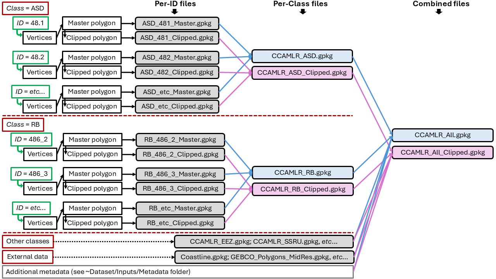

<!-- README.md is generated from README.Rmd. Please edit that file -->

# Dataset

------------------------------------------------------------------------

### Overview

This page provides an overview of the workflow used by the Secretariat
to build, update and maintain the spatial objects distributed here:
<https://github.com/ccamlr/data>. The aim of this repository is to
provide a transparent portal to publish all the inputs, scripts, outputs
and derived products that are used in routine mapping and analyses
conducted by the Secretariat. In doing so, the workflow is open to
review, comments and improvement suggestions.

### Contents

------------------------------------------------------------------------

1.  [Folder structure](#1-folder-structure)
2.  [Workflow](#2-workflow)
3.  [Subarea 48.1 example](#3-subarea-481-example)
4.  [Output files](#4-output-files)

------------------------------------------------------------------------

 

### 1. Folder structure

All elements relevant to the geospatial workflow are in the
[Dataset](https://github.com/ccamlr/geospatial_operations/tree/main/Dataset)
folder, which contains the following sub-folders:

- External data: Spatial objects that are built using inputs from
  external sources such as coastlines and bathymetry polygons.

- GeoPackages: Spatial objects combined into standalone *.gpkg* files.

- Inputs: Scripts and resulting *.csv* files of vertices locations, and
  additional metadata. These vertices are used to build spatial objects.

- Outputs: Exported spatial objects, in *.gpkg* format. File names are
  formatted as: *Class*\_*ID*\_*Master/Clipped*.gpkg, where *Class* is
  the object class (*e.g.*, Subarea or Research Block); *ID* is the
  object identifier (*e.g.*, 48.1 or 5842_1); and *Master/Clipped*
  indicates whether the object was clipped to the latest coastline
  (*Clipped*) or not (*Master*).

- Plots: Figures generated during the creation of spatial objects,
  useful to visualise vertices and the resulting spatial objects.

- Scripts: R scripts used to (i) collate all necessary types of vertices
  and (ii) build spatial objects.

------------------------------------------------------------------------

### 2. Workflow

In its simplest form, the workflow is demonstrated in the example given
[here](https://github.com/ccamlr/geospatial_operations/blob/main/Documentation/Building_Polygons.md#building-polygons),
and relies on the use of a dataset of vertices (see [Inputs
folder](https://github.com/ccamlr/geospatial_operations/tree/main/Dataset/Inputs)).
All polygons have **primary vertices** (as described in their FAO
definitions, for example) and may have additional vertices that are
needed as part of their design. Overall, the dataset of vertices will
consist of four classes:

- **Primary vertices**: essential vertices required to build a polygon,
  locating each of its corners,

- **Secondary vertices**: additional vertices used to mark the edges of
  a contiguous polygon (see Figure 2
  [here](https://github.com/ccamlr/geospatial_operations/blob/main/Documentation/Building_Polygons.md#step-1---build-a-table-of-vertices)),
  or the intersection of edges, and used to ensure the absence of gaps
  between polygons,

- **Inland vertices**: additional vertices used to assist in building
  polygons that are bound by the continent (see
  [here](https://github.com/ccamlr/geospatial_operations/blob/main/Dataset/Inputs/Master%20Inland%20Vertices/Master_IV_Check6.png)),
  and,

- **Master vertices**: a combination of the above three classes, used to
  build polygons while adhering to the Geospatial Rules.

A summary of the steps taken is given below (Fig. 1).

 

Figure 1. Geospatial workflow steps.

 

Each individual spatial object has a *Class* (*e.g.*, ASD) and *ID*
(*e.g.*, 48.1), and most spatial objects have two scripts taking part in
the workflow: (i) *ID*\_Step1_Vertices.R collates the **Master
vertices** (steps 1–4 above), and (ii) *ID*\_Step2_Polygons.R builds the
spatial objects (steps 5–7 above). All scripts are available in the
[Scripts
folder](https://github.com/ccamlr/geospatial_operations/tree/main/Dataset/Scripts),
and figures generated during the process are in the [Plots
folder](https://github.com/ccamlr/geospatial_operations/tree/main/Dataset/Plots).
The grouping of objects into per-*Class* geopackages, as well as the
collation of all objects into a single “CCAMLR_All” file (steps 8–10
above) are done using the “Build_GeoPackages.R” script stored in the
[GeoPackages
folder](https://github.com/ccamlr/geospatial_operations/tree/main/Dataset/GeoPackages).

The figure below (Fig. 2) summarises how individual files are generated
for each *ID*, combined into per-Class files, and, after adding external
data and additional metadata, merged into a combined file (*e.g.*,
CCAMLR_All.gpkg).

 

Figure 2. Summary of geopackage files generation.

 

------------------------------------------------------------------------

### 3. Subarea 48.1 example

While browsing the [Scripts
folder](https://github.com/ccamlr/geospatial_operations/tree/main/Dataset/Scripts)
helps understand the details of the process used to build individual
files, a step-by-step working example using Subarea 48.1 is given
[here](https://github.com/ccamlr/geospatial_operations/blob/main/Documentation/Subarea_481_Example.md#subarea-481-example).

------------------------------------------------------------------------

### 4. Output files

As described above (Fig. 2) the geospatial workflow generates 3 types of
files:

- Per-ID files: each is generated by two scripts to store one spatial
  object, for example: “ASD_481_Master.gpkg”.

- Per-Class files: generated by Build_GeoPackages.R in the [GeoPackages
  folder](https://github.com/ccamlr/geospatial_operations/tree/main/Dataset/GeoPackages),
  which combines per-ID files of the same *Class*, for example:
  “CCAMLR_ASD.gpkg”.

- Combined files: generated by Build_GeoPackages.R in the [GeoPackages
  folder](https://github.com/ccamlr/geospatial_operations/tree/main/Dataset/GeoPackages),
  which combines all per-Class files, adds external files and additional
  metadata. Two files exist: “CCAMLR_All.gpkg” and
  “CCAMLR_All_Clipped.gpkg”.

- External files: generated using external data and stored with their
  scripts in the [External data
  folder](https://github.com/ccamlr/geospatial_operations/tree/main/Dataset/External%20data).
  Their documentation is available
  [here](https://github.com/ccamlr/geospatial_operations/blob/main/Documentation/External_data.md).
