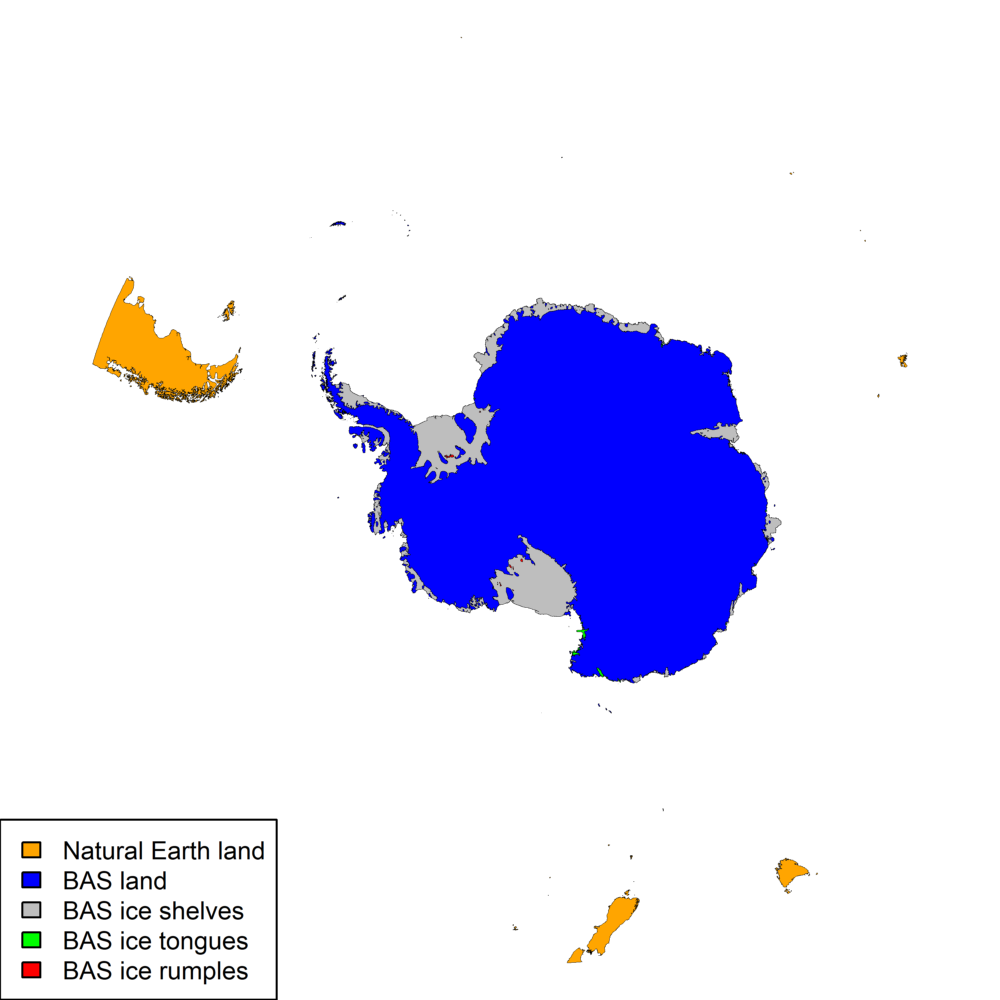
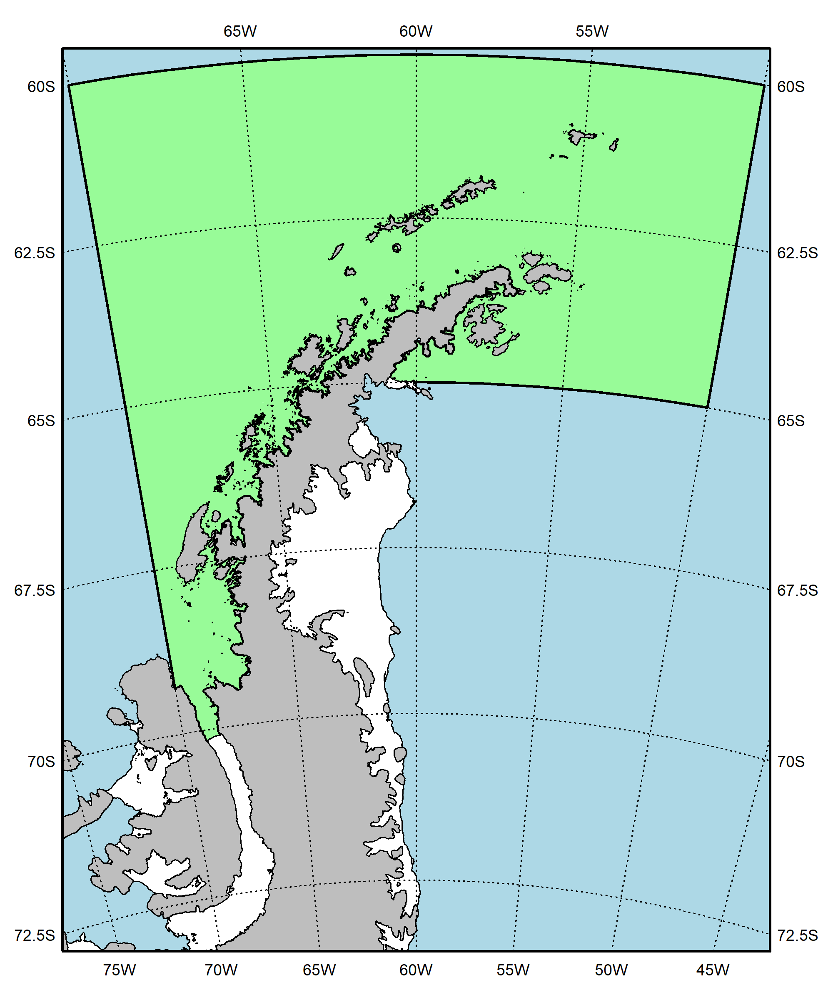
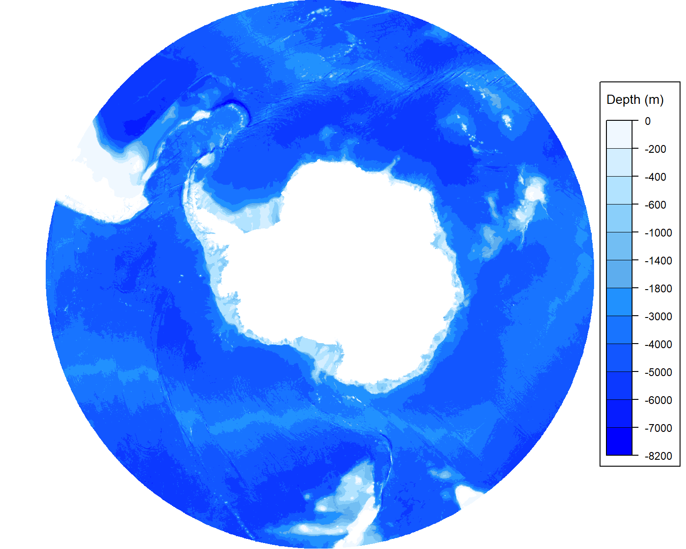

<!-- README.md is generated from README.Rmd. Please edit that file -->

<center>

# External data

</center>

This page documents the inputs, methods and R scripts used to generate
geopackages containing external data (*e.g.*, coastlines and bathymetry)
for CCAMLR use.

<center>

### Contents

</center>

------------------------------------------------------------------------

1.  [Coastlines](#1-coastlines)
2.  [Bathymetry](#2-bathymetry)

------------------------------------------------------------------------

### 1. Coastlines

Since 2024, the CCAMLR Secretariat maintains coastlines layers produced
following the Geospatial Rules. Layers from two main data sources are
used; from the [UK Polar Data
Centre](https://www.bas.ac.uk/team/business-teams/information-services/uk-polar-data-centre/)
(which generates the layers used in the [SCAR
ADD](https://www.scar.org/resources/antarctic-digital-database/)) and
from [Natural Earth](https://www.naturalearthdata.com/) (a public domain
map dataset supported by the [North American Cartographic Information
Society](https://nacis.org/)).

More specifically, four datasets are used. These are:

- High resolution vector polygons of the Antarctic coastline
  - Source: British Antarctic Survey / UK Polar Data Centre
  - Short description: Coastline and ice shelves south of 60S
  - URL: <https://doi.org/10.5285/c7fe759d-e042-479a-9ecf-274255b4f0a1>
  - Citation: Gerrish, L., Ireland, L., Fretwell, P., & Cooper, P.
    (2023). High resolution vector polygons of the Antarctic coastline -
    VERSION 7.8 (Version 7.8) (Data set). NERC EDS UK Polar Data Centre.
    <https://doi.org/10.5285/c7fe759d-e042-479a-9ecf-274255b4f0a1>
- Vector polygons of the Sub-Antarctic coastline
  - Source: British Antarctic Survey / UK Polar Data Centre
  - Short description: Coastline between 50S and 60S (from which the
    data between 50W and 20W is extracted)
  - URL: <https://doi.org/10.5285/c1d83502-8799-4e3c-bdca-21db6a4405d4>
  - Citation: Gerrish, L. (2020). Vector polygons of the Sub-Antarctic
    coastline - VERSION 7.3 (Version 1.0) (Data set). UK Polar Data
    Centre, Natural Environment Research Council, UK Research &
    Innovation.
    <https://doi.org/10.5285/c1d83502-8799-4e3c-bdca-21db6a4405d4>
- Land polygons including major islands
  - Source: Natural Earth
  - Short description: 1:10m Physical Vectors for major land masses
    (from which the data between 40S and 60S is extracted)
  - URL:
    <https://www.naturalearthdata.com/downloads/10m-physical-vectors/>
  - Citation: Made with Natural Earth. Free vector and raster map data @
    naturalearthdata.com.
- Islands that are 2 sq. km or less in size
  - Source: Natural Earth
  - Short description: 1:10m Physical Vectors for minor islands (from
    which the data between 40S and 60S is extracted)
  - URL:
    <https://www.naturalearthdata.com/downloads/10m-physical-vectors/>
  - Citation: Made with Natural Earth. Free vector and raster map data @
    naturalearthdata.com.

These data are combined, projected and simplified with a 10m tolerance
using the
[Coastline.R](https://github.com/ccamlr/geospatial_operations/tree/main/Dataset/External%20data/Scripts)
script. The following script shows how to plot the coastline while
color-coding the data sources and types:

``` r
library(CCAMLRGIS)

#Load Coastline
Coast=load_Coastline()

#Plot
png(filename=paste0(Pth,"Figures/Coastline.png"),width=3000,height=3000,res=600)
par(mai=rep(0,4))
plot(st_geometry(Coast[Coast$source=="Natural Earth",]),col="orange",lwd=0.01)
plot(st_geometry(Coast[Coast$source=="BAS" & Coast$layer=="Land",]),col="blue",add=T,lwd=0.01)
plot(st_geometry(Coast[Coast$layer=="Ice shelves",]),col="grey",add=T,lwd=0.01)
plot(st_geometry(Coast[Coast$layer=="Ice tongues",]),col="green",add=T,lwd=0.01)
plot(st_geometry(Coast[Coast$layer=="Ice rumples",]),col="red",add=T,lwd=0.01)
legend("bottomleft",
       legend=c('Natural Earth land','BAS land','BAS ice shelves','BAS ice tongues','BAS ice rumples'),
       fill=c('orange','blue','grey','green','red'),
       seg.len=0,cex=0.75,
       xpd=TRUE)
d=dev.off()
```

<div class="figure" style="text-align: center">


<p class="caption">

Figure 1. CCAMLR coastline with elements color-coded by source. Sources:
UK Polar Data Centre/BAS and Natural Earth. Projection: EPSG 6932.
</p>

</div>

<br>

The data contained in the geopackage is structured as follows (where
*version* is the version of the CCAMLR coastline), with a row per set of
polygons:

| version | source | srcvrsn | layer | surface |
|:---|:---|:---|:---|:---|
| 1.0 | Natural Earth | Land V5.1.1 and Minor Islands V4.1.0 | Land | Land |
| 1.0 | BAS | Ant. coastline V7.8 and Sub-Ant. coastline V7.3 | Land | Land |
| 1.0 | BAS | Ant. coastline V7.8 | Ice shelves | Ice |
| 1.0 | BAS | Ant. coastline V7.8 | Ice tongues | Ice |
| 1.0 | BAS | Ant. coastline V7.8 | Ice rumples | Ice |

<br>

The following script shows how to plot a specific subset of the data
(*e.g.*, for Subarea 48.1), after rotating it so that North points up:

``` r
library(CCAMLRGIS)

#Load Coastline
Coast=load_Coastline()

#Load ASDs
ASDs=load_ASDs()
#Isolate Subarea 48.1
A481=ASDs[ASDs$GAR_Short_Label=="481",] 

#Rotate objects
Lonzero=-60 #This longitude will point up
R_A481=Rotate_obj(A481,Lonzero)
R_coast=Rotate_obj(Coast,Lonzero)

#Create a bounding box for the region
bb=st_bbox(st_buffer(R_A481,10000)) #Get bounding box (x/y limits) + buffer
bx=st_as_sfc(bb) #Build spatial box to plot

#Use bounding box to crop coastline
R_coast=suppressWarnings( st_intersection(R_coast,bx) )


#Plot
png(filename=paste0(Pth,'Figures/Coastline_481.png'),width=2000,height=2400,res=300)
par(mai=rep(0.1,4)) #margins
plot(bx,col="lightblue")
plot(st_geometry(R_A481),border="black",lwd=2,add=T,col="palegreen")
plot(st_geometry(R_coast[R_coast$surface=="Land",]),col="grey",add=T)
plot(st_geometry(R_coast[R_coast$surface=="Ice",]),col="white",add=T)
add_RefGrid(bb=bb,ResLat = 2.5,ResLon = 5,lwd=1,fontsize = 0.75)
plot(bx,lwd=2,add=T,xpd=T)

legend(x=250000,y=2050000,
       legend=c('Subarea 48.1','Ocean','Land', 'Ice Shelves'),
       fill=c("palegreen","lightblue","grey","white"),
       xpd=T)

d=dev.off()
```

<div class="figure" style="text-align: center">


<p class="caption">

Figure 2. CCAMLR coastline for Subarea 48.1. Sources: UK Polar Data
Centre/BAS and Natural Earth. Projection: EPSG 6932 (rotated).
</p>

</div>

<br>

------------------------------------------------------------------------

### 2. Bathymetry

The CCAMLR Secretariat uses [GEBCO](https://www.gebco.net/) as its
bathymetry data source. Starting from the raw data, two derived products
are generated:

- Rasters: ‘*.tif*’ files in which the data was reprojected (to
  EPSG:6932) after cropping at 40°S, and aggregated at different
  resolutions. These are available
  [here](https://github.com/ccamlr/data/tree/main/geographical_data/bathymetry).

- Contour polygons: ‘*.gpkg*’ files built using the
  [get_iso_polys()](https://github.com/ccamlr/CCAMLRGIS#46-get_iso_polys)
  function within the
  [Bathymetry_Polygons.R](https://github.com/ccamlr/geospatial_operations/blob/main/Dataset/External%20data/Scripts/Bathymetry_Polygons.R)
  script, which converts raster data into polygons that delineate
  isobaths. Three files of different resolution are produced, each
  containing elements that help plotting maps (per-polygon colour as
  well as the corresponding colorscale information). An example is given
  below (Fig. 3).

``` r
Bathy=st_read(paste0(Pth,"Dataset/External data/GEBCO_Polygons_LoRes.gpkg"),quiet=T)

png(filename=paste0(Pth,'Figures/Bathy_LoRes_demo.png'),width=1500,height=1200,res=200)
par(mai=c(0,0,0,0.5),xaxs="i",yaxs="i",xpd=T) #margins
plot(st_geometry(Bathy),col=Bathy$c,border=NA)
add_Cscale(cuts=Bathy$Scale_cuts[is.na(Bathy$Scale_cuts)==F],
           cols=Bathy$Scale_cols[is.na(Bathy$Scale_cols)==F],
           offset=-850,fontsize=0.7,width=13)
d=dev.off()
```

<div class="figure" style="text-align: center">


<p class="caption">

Figure 3. Polygon contours of the GEBCO bathymetry
(‘GEBCO_Polygons_LoRes.gpkg’).
</p>

</div>
