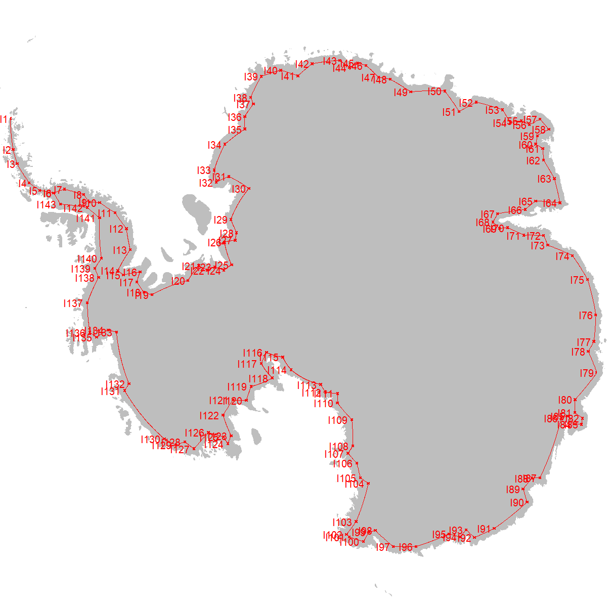
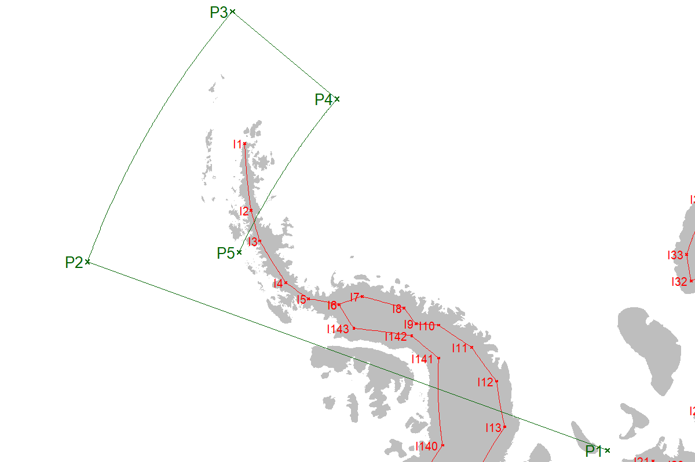
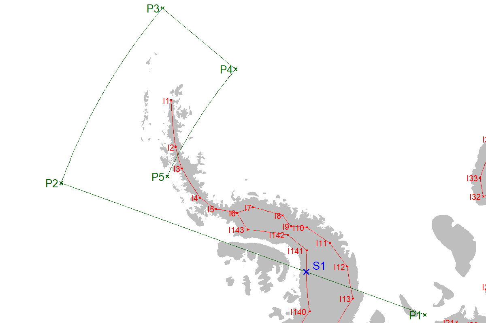
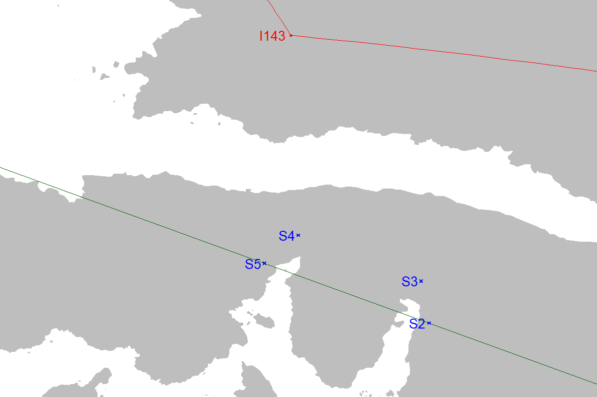
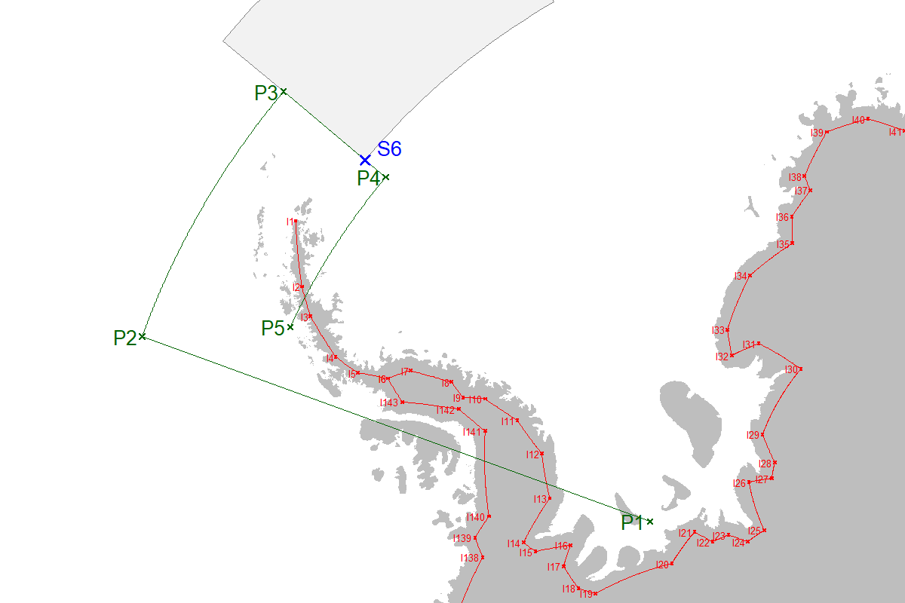
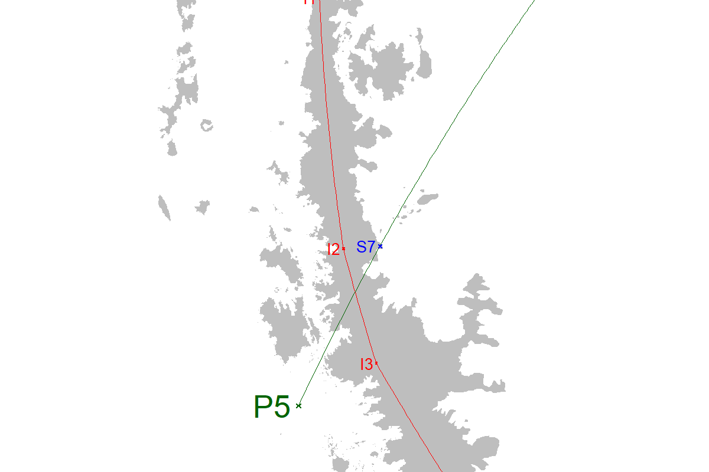
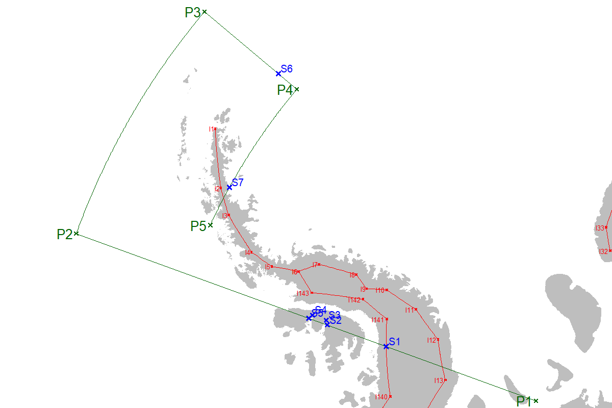
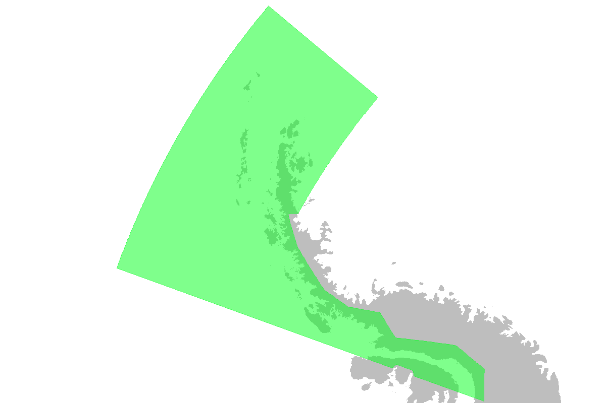
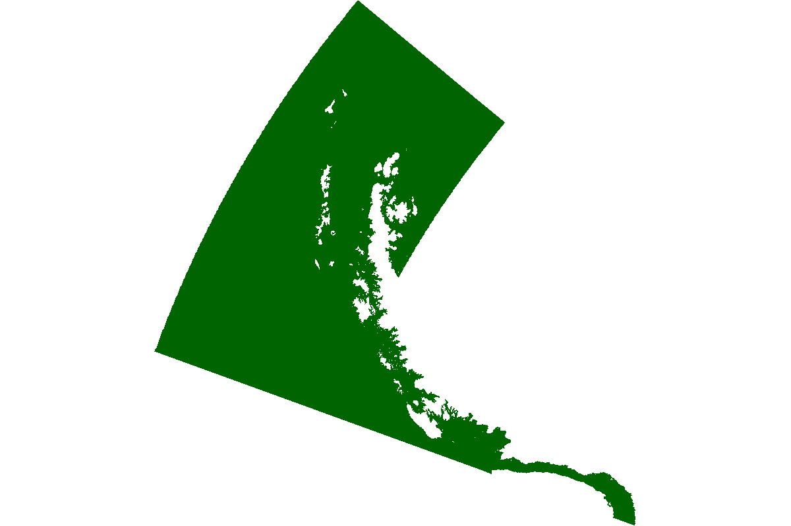

<!-- README.md is generated from README.Rmd. Please edit that file -->

<center>

# Subarea 48.1 example

</center>

<center>

### Overview

</center>

A polygon is a clockwise series of vertices connected by edges.

All polygons have **primary vertices** (as described in their FAO
definitions, for example) and may have additional vertices that are
needed as part of their design. Overall, the dataset of vertices will
consist of four classes:

- **Primary vertices**: essential vertices required to build a polygon,
  locating each of its corners,

- **Secondary vertices**: additional vertices used to mark the edges of
  a contiguous polygon, or the intersection of edges, and used to ensure
  the absence of gaps between polygons,

- **Inland vertices**: additional vertices used to assist in building
  polygons that are bound by the continent (see Fig. 1 below),

- **Master vertices**: a combination of the above three classes, used to
  build polygons while adhering to the Geospatial Rules.

This page presents an example requiring all three classes of vertices to
obtain a set of master vertices, to build the Subarea 48.1 polygon.

<br>

<center>

### Contents

</center>

------------------------------------------------------------------------

1.  [Inland vertices](#1-inland-vertices)
2.  [Primary vertices](#2-primary-vertices)
3.  [Secondary vertices](#3-secondary-vertices)
4.  [Master vertices](#4-master-vertices)
5.  [Master polygon](#5-master-polygon)
6.  [Clipped polygon](#6-clipped-polygon)

------------------------------------------------------------------------

### 1. Inland vertices

The inland vertices used throughout the geospatial workflow are stored
along with their script
[here](https://github.com/ccamlr/geospatial_operations/tree/main/Dataset/Inputs)
(Fig. 1).

<div class="figure" style="text-align: center">


<p class="caption">

Figure 1. Location of inland vertices, each prefixed with the letter
‘I’.
</p>

</div>

<br>

------------------------------------------------------------------------

### 2. Primary vertices

The description of Subarea 48.1, as given on the [FAO
website](https://www.fao.org/fishery/en/area/48) is:

<center>

*The waters bounded by a line commencing from a point at 70°00’W
longitude on the coast of Antarctica at Palmer Land; thence running
across the George VI Sound to a point at 70°00’W longitude on the south
coast of Alexander Island; thence along the east coast of this island to
a point on the northeast coast at 70°00’W longitude; thence due north to
60°00’S latitude; thence due east to 50°00’W longitude; thence due south
to 65°00’S latitude; thence due west to a point on the east coast of the
Antarctic Peninsula at 65°00’S latitude; thence running in a
northeasterly and then southwesterly direction along the coast of the
Antarctic Peninsula to the point of departure.*

</center>

<br>

From this text, we get the following table of primary vertices:

| Vertex | Latitude | Longitude |
|:-------|:---------|:----------|
| P1     | coast    | -70       |
| P2     | -60      | -70       |
| P3     | -60      | -50       |
| P4     | -65      | -50       |
| P5     | -65      | coast     |

Where locations are denoted as ‘coast’, temporary locations will be used
as to extend those lines sufficiently so that they go inland. For
example, the latitude of vertex P1 could be -80° and the longitude of
vertex P5 could be -65°:

``` r
V_481=data.frame(
  Vertex=c('P1','P2','P3','P4','P5'),
  Latitude=c(-80,-60,-60,-65,-65),
  Longitude=c(-70,-70,-50,-50,-65)
)
Vs481=create_Points(Input=V_481[,c(2,3,1)])
Ls481=create_Lines(Input=data.frame(n=1,V_481$Latitude,V_481$Longitude),Densify = T)

png(filename=paste0(Pth,'Figures/Subarea_481_Example_Fig02.png'),width=1200,height=800,res=200)
par(mai=rep(0.1,4),xaxs="i",yaxs="i",xpd=T)
plot(st_geometry(Vs481),col="white") #blank plot to set plot boundaries
plot(st_geometry(Coast[Coast$ID=='All',]),col='grey',border=NA,add=T,xpd=T)
plot(st_geometry(Ls),add=T,lwd=0.5,col="red")
plot(st_geometry(Vs),add=T,pch=4,cex=0.25,col="red")
text(Vs$x,Vs$y,Vs$Vertex,adj=c(1.2,0.5),col="red",xpd=T,cex=0.6)
plot(st_geometry(Ls481),add=T,lwd=0.5,col="darkgreen")
plot(st_geometry(Vs481),add=T,pch=4,cex=0.5,col="darkgreen")
text(Vs481$x,Vs481$y,Vs481$Vertex,adj=c(1.2,0.5),col="darkgreen",xpd=T,cex=0.8)
d=dev.off()
```

<div class="figure" style="text-align: center">


<p class="caption">

Figure 2. Location of inland vertices in red, and Subarea 48.1 primary
vertices in green.
</p>

</div>

<br>

------------------------------------------------------------------------

### 3. Secondary vertices

Despite being seemingly simple, the FAO definition generates some design
complexity. To build the Subarea 48.1 polygon, several sets of secondary
vertices (prefixed with the letter ‘S’) are needed, as described below.

### 3.1. Secondary vertices – finding the inland vertex for the western boundary

To locate the vertex inside the Peninsula, the function
*[get_C_intersection()](https://cran.r-project.org/web/packages/CCAMLRGIS/refman/CCAMLRGIS.html#get_C_intersection)*
of the CCAMLRGIS package is used to get the location of the intersection
of lines P1–P2 and I140–I141, as:

``` r
#Give line coordinates as: c(Longitude_start,Latitude_start,Longitude_end,Latitude_end)
get_C_intersection(Line1=c(V_481$Longitude[1],V_481$Latitude[1],
                           V_481$Longitude[2],V_481$Latitude[2]),
                   Line2=c(V_inland$Longitude[140],V_inland$Latitude[140],
                           V_inland$Longitude[141],V_inland$Latitude[141]),Plot=F)
#>      Lon      Lat 
#> -70.0000 -73.5517
```

``` r
Sec=data.frame(
  Latitude=c(-73.55),
  Longitude=c(-70),
  Vertex=c("S1")
)
VsSec=create_Points(Sec)

png(filename=paste0(Pth,'Figures/Subarea_481_Example_Fig03.png'),width=1200,height=800,res=200)
par(mai=rep(0.1,4),xaxs="i",yaxs="i",xpd=T)
plot(st_geometry(Vs481),col="white") #blank plot to set plot boundaries
plot(st_geometry(Coast[Coast$ID=='All',]),col='grey',border=NA,xpd=T,add=T)
plot(st_geometry(Ls),add=T,lwd=0.5,col="red")
plot(st_geometry(Vs),add=T,pch=4,cex=0.25,col="red")
text(Vs$x,Vs$y,Vs$Vertex,adj=c(1.2,0.5),col="red",xpd=T,cex=0.6)
plot(st_geometry(Ls481),add=T,lwd=0.5,col="darkgreen")
plot(st_geometry(Vs481),add=T,pch=4,cex=0.5,col="darkgreen")
text(Vs481$x,Vs481$y,Vs481$Vertex,adj=c(1.2,0.5),col="darkgreen",xpd=T,cex=0.8)
plot(st_geometry(VsSec),add=T,pch=4,cex=0.8,col="blue",lwd=1.5)
text(VsSec$x,VsSec$y,VsSec$Vertex,adj=c(-0.5,-0.3),col="blue",xpd=T,cex=0.8)
d=dev.off()
```

<div class="figure" style="text-align: center">


<p class="caption">

Figure 3. Location of inland vertices in red; Subarea 48.1 primary
vertices in green and secondary vertex in blue (here S1 is at
73.55°S;70°W).
</p>

</div>

#### 3.2. Secondary vertices – Alexander Island

A set of secondary vertices is required on [Alexander
Island](https://en.wikipedia.org/wiki/Alexander_Island) so that the
western boundary of Subarea 48.1 does not include two bays when clipped
to the coastline:

``` r
Sec=data.frame(
  Latitude=c(-71,-70.9,-70.3,-70.2),
  Longitude=c(-70,-69.5,-69.5,-70),
  Vertex=c("S2","S3","S4","S5")
)
VsSec=create_Points(Sec)

png(filename=paste0(Pth,'Figures/Subarea_481_Example_Fig04.png'),width=1200,height=800,res=200)
par(mai=rep(0,4),xaxs="i",yaxs="i")
plot(st_geometry(Coast[Coast$ID=='All',]),col='grey',border=NA,
     xlim=c(-2200000,-1900000),ylim=c(750000,820000),xpd=T)
plot(st_geometry(Ls),add=T,lwd=0.5,col="red")
plot(st_geometry(Vs),add=T,pch=4,cex=0.25,col="red")
text(Vs$x,Vs$y,Vs$Vertex,adj=c(1.2,0.5),col="red",xpd=T,cex=0.8)
plot(st_geometry(Ls481),add=T,lwd=0.5,col="darkgreen")
plot(st_geometry(Vs481),add=T,pch=4,cex=0.5,col="darkgreen")
text(Vs481$x,Vs481$y,Vs481$Vertex,adj=c(1.2,0.5),col="darkgreen",xpd=T,cex=1.6)
plot(st_geometry(VsSec),add=T,pch=4,cex=0.4,col="blue")
text(VsSec$x,VsSec$y,VsSec$Vertex,adj=c(1.2,0.5),col="blue",xpd=T,cex=0.8)
d=dev.off()
```

<div class="figure" style="text-align: center">


<p class="caption">

Figure 4. Location of inland vertices in red; Subarea 48.1 western edge
in green and secondary vertices in blue.
</p>

</div>

#### 3.3. Secondary vertices – marking the Subarea 48.2 vertex

Subarea 48.1 shares part of its eastern edge with Subarea 48.2. A
secondary vertex is needed to mark the extremity of the Subarea 48.2
edge (at 64°S, see S6 below):

``` r
#Get 48.2
A482=load_ASDs()
A482=A482[A482$GAR_Short_Label=="482",]
Sec=data.frame(
  Latitude=c(-64),
  Longitude=c(-50),
  Vertex=c("S6")
)
VsSec=create_Points(Sec)

png(filename=paste0(Pth,'Figures/Subarea_481_Example_Fig05.png'),width=1200,height=800,res=200)
par(mai=rep(0,4),xaxs="i",yaxs="i")
plot(st_geometry(Coast[Coast$ID=='All',]),col='grey',border=NA,
    xlim=c(-3200000,-500000),ylim=c(50000,2500000),xpd=T)
plot(st_geometry(A482),add=T,lwd=0.0001,col="grey95",border="grey50")
plot(st_geometry(Ls),add=T,lwd=0.5,col="red")
plot(st_geometry(Vs),add=T,pch=4,cex=0.25,col="red")
text(Vs$x,Vs$y,Vs$Vertex,adj=c(1.2,0.5),col="red",xpd=T,cex=0.4)
plot(st_geometry(Ls481),add=T,lwd=0.5,col="darkgreen")
plot(st_geometry(Vs481),add=T,pch=4,cex=0.5,col="darkgreen")
text(Vs481$x,Vs481$y,Vs481$Vertex,adj=c(1.2,0.5),col="darkgreen",xpd=T,cex=0.8)
plot(st_geometry(VsSec),add=T,pch=4,cex=0.8,col="blue",lwd=1.5)
text(VsSec$x,VsSec$y,VsSec$Vertex,adj=c(-0.5,-0.3),col="blue",xpd=T,cex=0.8)
d=dev.off()
```

<div class="figure" style="text-align: center">


<p class="caption">

Figure 5. Location of inland vertices in red; Subarea 48.1 primary
vertices in green and secondary vertex in blue (here S6 denotes the
extremity of the western edge of Subarea 48.2 which is shown in pale
grey).
</p>

</div>

#### 3.4. Secondary vertices – Eastern Peninsula

A secondary vertex is required where the line P4–P5 meets the eastern
coast of the peninsula (denoted S7):

``` r
Sec=data.frame(
  Latitude=c(-65),
  Longitude=c(-61.07),
  Vertex=c("S7")
)
VsSec=create_Points(Sec)

png(filename=paste0(Pth,'Figures/Subarea_481_Example_Fig06.png'),width=1200,height=800,res=200)
par(mai=rep(0,4),xaxs="i",yaxs="i")
plot(st_geometry(Coast[Coast$ID=='All',]),col='grey',border=NA,
     xlim=c(-2500000,-2400000),ylim=c(1100000,1600000),xpd=T)
plot(st_geometry(Ls),add=T,lwd=0.5,col="red")
plot(st_geometry(Vs),add=T,pch=4,cex=0.25,col="red")
text(Vs$x,Vs$y,Vs$Vertex,adj=c(1.2,0.5),col="red",xpd=T,cex=0.8)
plot(st_geometry(Ls481),add=T,lwd=0.5,col="darkgreen")
plot(st_geometry(Vs481),add=T,pch=4,cex=0.5,col="darkgreen")
text(Vs481$x,Vs481$y,Vs481$Vertex,adj=c(1.2,0.5),col="darkgreen",xpd=T,cex=1.6)
plot(st_geometry(VsSec),add=T,pch=4,cex=0.4,col="blue")
text(VsSec$x,VsSec$y,VsSec$Vertex,adj=c(1.2,0.5),col="blue",xpd=T,cex=0.8)
d=dev.off()
```

<div class="figure" style="text-align: center">


<p class="caption">

Figure 6. Location of inland vertices in red; Subarea 48.1 primary
vertices in green and secondary vertex (S7) in blue.
</p>

</div>

#### 3.5. Secondary vertices – Summary

Putting all secondary vertices together results in:

``` r
Sec=data.frame(
  Latitude=c(-73.55,-71,-70.9,-70.3,-70.2,-64,-65),
  Longitude=c(-70,-70,-69.5,-69.5,-70,-50,-61.07),
  Vertex=c("S1","S2","S3","S4","S5","S6","S7")
)
VsSec=create_Points(Sec)

png(filename=paste0(Pth,'Figures/Subarea_481_Example_Fig07.png'),width=1200,height=800,res=200)
par(mai=rep(0,4),xaxs="i",yaxs="i")
plot(st_geometry(Coast[Coast$ID=='All',]),col='grey',border=NA,
    xlim=c(-3120000,-1040000),ylim=c(350000,2180000),xpd=T)
plot(st_geometry(Ls),add=T,lwd=0.5,col="red")
plot(st_geometry(Vs),add=T,pch=4,cex=0.25,col="red")
text(Vs$x,Vs$y,Vs$Vertex,adj=c(1.2,0.5),col="red",xpd=T,cex=0.4)
plot(st_geometry(Ls481),add=T,lwd=0.5,col="darkgreen")
plot(st_geometry(Vs481),add=T,pch=4,cex=0.5,col="darkgreen")
text(Vs481$x,Vs481$y,Vs481$Vertex,adj=c(1.2,0.5),col="darkgreen",xpd=T,cex=0.8)
plot(st_geometry(VsSec),add=T,pch=4,cex=0.5,col="blue",lwd=1.5)
text(VsSec$x,VsSec$y,VsSec$Vertex,adj=c(-0.2,-0.2),col="blue",xpd=T,cex=0.6)
d=dev.off()
```

<div class="figure" style="text-align: center">


<p class="caption">

Figure 7. Location of inland vertices in red; Subarea 48.1 primary
vertices in green and secondary vertices in blue.
</p>

</div>

<br>

------------------------------------------------------------------------

### 4. Master vertices

The Subarea 48.1 polygon is now ready to be built, using the following
sequence of **Primary** (*Pxx*), **Secondary** (*Sxx*) and **Inland**
(*Ixx*) vertices, given clockwise and starting from ‘S1’:

| Vertex | Latitude | Longitude |
|:-------|---------:|----------:|
| S1     |   -73.55 |    -70.00 |
| S2     |   -71.00 |    -70.00 |
| S3     |   -70.90 |    -69.50 |
| S4     |   -70.30 |    -69.50 |
| S5     |   -70.20 |    -70.00 |
| P2     |   -60.00 |    -70.00 |
| P3     |   -60.00 |    -50.00 |
| S6     |   -64.00 |    -50.00 |
| P4     |   -65.00 |    -50.00 |
| S7     |   -65.00 |    -61.07 |
| I2     |   -64.70 |    -61.50 |
| I3     |   -65.50 |    -63.40 |
| I4     |   -67.00 |    -65.70 |
| I5     |   -68.00 |    -66.20 |
| I6     |   -69.09 |    -65.51 |
| I143   |   -69.93 |    -67.11 |
| I142   |   -71.95 |    -65.33 |
| I141   |   -73.16 |    -66.44 |

<br>

------------------------------------------------------------------------

### 5. Master polygon

Using this table of vertices in the *create_Polys()* function of the
CCAMLRGIS packages yields:

``` r
P=create_Polys(Input = data.frame(Name="Subarea 48.1",
                                  Lat=MT_481$Latitude,
                                  Lon=MT_481$Longitude))

png(filename=paste0(Pth,'Figures/Subarea_481_Example_Fig08.png'),width=1200,height=800,res=200)
par(mai=rep(0,4),xaxs="i",yaxs="i")
plot(st_geometry(Coast[Coast$ID=='All',]),col='grey',border=NA,
    xlim=c(-3110000,-1700000),ylim=c(620000,2150000),xpd=T)
plot(st_geometry(P),add=T,lwd=0.5,col=rgb(0,1,0.1,alpha=0.5),border=rgb(0,1,0.1,alpha=0.5))
d=dev.off()
```

<div class="figure" style="text-align: center">


<p class="caption">

Figure 8. Subarea 48.1 master polygon built from the master table of
vertices.
</p>

</div>

<br>

------------------------------------------------------------------------

### 6. Clipped polygon

Finally, using the *st_difference()* function from the
[sf](https://cran.r-project.org/web/packages/sf/index.html) package, the
polygon is clipped to the coastline:

``` r
coast=load_Coastline()
coast=coast[coast$surface=="Land",]
coast=st_union(coast)
#Remove the coastline from the polygons
P481=suppressWarnings(st_difference(P,coast))
#Plot
png(filename=paste0(Pth,'Figures/Subarea_481_Example_Fig09.png'),width=1200,height=800,res=200)
par(mai=rep(0,4),xaxs="i",yaxs="i")
plot(st_geometry(P481),col="darkgreen",border=NA)
d=dev.off()
```

<div class="figure" style="text-align: center">


<p class="caption">

Figure 9. The Subarea 48.1 polygon, clipped to the latest coastline.
</p>

</div>
