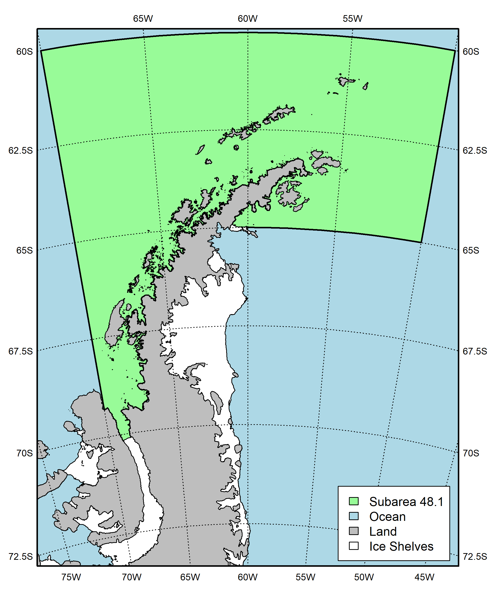

<!-- README.md is generated from README.Rmd. Please edit that file -->

```{r, echo = FALSE}
knitr::opts_chunk$set(
  collapse = TRUE,
  comment = "#>"
)
library(knitr)
```


<center>
# CCAMLR Geospatial Operations
</center>

------------------------------------------------------------------------

This repository contains R scripts used by the CCAMLR Secretariat to generate spatial layers, as well as examples of their use.

<center>
### Contents
</center>

------------------------------------------------------------------------

1.  [Geospatial Rules](#1-geospatial-rules)
2.  [Coastlines](#2-coastlines)
3.  [Polygons](#3-polygons)

------------------------------------------------------------------------


<br>

### 1. Geospatial Rules

[SC-CAMLR-42]:(https://meetings.ccamlr.org/sc-camlr-42)
[6932]:https://epsg.org/crs_6932/WGS-84-NSIDC-EASE-Grid-2-0-South.html
[WG-FSA-2023]:https://meetings.ccamlr.org/wg-fsa-2023

The following rules, as endorsed by the Scientific Committee in 2023 ([SC-CAMLR-42], paragraph 2.30), will be applied throughout. The rules will be updated if requested by the Scientific Committee.

(i) geographical information system (GIS) objects use the EPSG [6932] projection (*South Pole Lambert Azimuthal Equal-Area projection*),

(ii) lines of more than 0.1 degree of longitude be densified,

(iii) polygon vertices be given clockwise in decimal degrees with at least five decimal places,

(iv) vertices be added where polygons meet (see [WG-FSA-2023] Figure 1),

(v) inland vertices be used for polygons that are bound by any coastline (continent and islands),

(vi) polygons be clipped to all coastlines (continent and islands) based on the most recent available coastline data,

(vii) the coastline be based on the latest available coastline data, as obtained from the SCAR Antarctic Digital Database (ADD) and other sources where needed (e.g., www.naturalearthdata.com),

(viii) analyses cite CCAMLR geospatial data (i.e., shapefiles) as
CCAMLR. (Year). Geographical data layer: (Layer name). Version (Version), URL: (URL),

(ix) all maps cite data sources and projection used.


### 2. Coastlines

[UK Polar Data Centre]:https://www.bas.ac.uk/team/business-teams/information-services/uk-polar-data-centre/
[SCAR ADD]:https://www.scar.org/resources/antarctic-digital-database/
[Natural Earth]:https://www.naturalearthdata.com/
[North American Cartographic Information Society]:https://nacis.org/

Starting in 2024, the CCAMLR Secretariat will maintain coastlines layers produced following the Geospatial Rules. Layers from two main data sources are used; from the [UK Polar Data Centre] (which generates the layers used in the [SCAR ADD]) and from [Natural Earth] (a public domain map dataset supported by the [North American Cartographic Information Society]).

More specifically, four datasets are used. These are:

- High resolution vector polygons of the Antarctic coastline
    - Source: British Antarctic Survey / UK Polar Data Centre
    - Short description: Coastline and ice shelves south of 60S
    - URL: https://data.bas.ac.uk/full-record.php?id=GB/NERC/BAS/PDC/01787
    - Citation: Gerrish, L., Ireland, L., Fretwell, P., & Cooper, P. (2023). High resolution vector polygons of the Antarctic coastline - VERSION 7.8 (Version 7.8) (Data set). NERC EDS UK Polar Data Centre. https://doi.org/10.5285/c7fe759d-e042-479a-9ecf-274255b4f0a1
    
- Vector polygons of the Sub-Antarctic coastline
    - Source: British Antarctic Survey / UK Polar Data Centre
    - Short description: Coastline between 50S and 60S (from which the data between 50W and 20W is extracted)
    - URL: https://data.bas.ac.uk/full-record.php?id=GB/NERC/BAS/PDC/01430
    - Citation: Gerrish, L. (2020). Vector polygons of the Sub-Antarctic coastline - VERSION 7.3 (Version 1.0) (Data set). UK Polar Data Centre, Natural Environment Research Council, UK Research & Innovation. https://doi.org/10.5285/c1d83502-8799-4e3c-bdca-21db6a4405d4 
    
- Land polygons including major islands
    - Source: Natural Earth
    - Short description: 1:10m Physical Vectors for major land masses (from which the data between 40S and 60S is extracted)
    - URL: https://www.naturalearthdata.com/downloads/10m-physical-vectors/
    - Citation: Made with Natural Earth. Free vector and raster map data @ naturalearthdata.com.
    
- Islands that are 2 sq. km or less in size
    - Source: Natural Earth
    - Short description: 1:10m Physical Vectors for minor islands (from which the data between 40S and 60S is extracted)
    - URL: https://www.naturalearthdata.com/downloads/10m-physical-vectors/
    - Citation: Made with Natural Earth. Free vector and raster map data @ naturalearthdata.com.


[CoastlineVx_x.R script]:https://github.com/ccamlr/geospatial_operations/tree/main/Scripts/Coastline

These data are combined, projected and simplified with a 10m tolerance using the [CoastlineVx_x.R script]. A final set of shapefiles is produced and available here (link to data repo url) and through the *load_Coastline()* function of the CCAMLRGIS R package (Not yet implemented). The following script shows how to plot the coastline while color-coding the data sources and types:

```{r, message=F,eval=T,echo=T}
library(CCAMLRGIS)

#Load Coastline from a local source
Coast=st_read("Scripts/Coastline/CCAMLR_Coastline_V1_0.shp",quiet = T)

#Plot
png(filename="Figures/Coastline.png",width=3000,height=3000,res=600)
par(mai=rep(0,4))
plot(st_geometry(Coast[Coast$Source=="Natural Earth",]),col="orange",lwd=0.01)
plot(st_geometry(Coast[Coast$Source=="BAS" & Coast$Layer=="Land",]),col="blue",add=T,lwd=0.01)
plot(st_geometry(Coast[Coast$Layer=="Ice shelves",]),col="grey",add=T,lwd=0.01)
plot(st_geometry(Coast[Coast$Layer=="Ice tongues",]),col="green",add=T,lwd=0.01)
plot(st_geometry(Coast[Coast$Layer=="Ice rumples",]),col="red",add=T,lwd=0.01)
legend("bottomleft",legend=c('Natural Earth land','BAS land','BAS ice shelves','BAS ice tongues','BAS ice rumples'),
       fill=c('orange','blue','grey','green','red'),
       seg.len=0,cex=0.75,
       xpd=TRUE)
dev.off()

```


```{r fig.align="center",out.width="80%",message=F,dpi=300,echo=F,eval=T,fig.cap="Figure 1. CCAMLR coastline with elements color-coded by source. Sources: UK Polar Data Centre/BAS and Natural Earth. Projection: EPSG 6932."}
include_graphics("Figures/Coastline.png")
```


<br>

<br>

The data contained in the shapefile is structured as follows (where *Version* is the version of the CCAMLR coastline), with a row per set of polygons:

```{r, message=F,eval=T,echo=F}
Tab=st_drop_geometry(Coast)
kable(Tab)
```

<br>

The following script shows how to plot a specific subset of the data (*e.g.*, for Subarea 48.1), after rotating it so that North points up:

```{r, message=F,eval=T,echo=T}
library(CCAMLRGIS)

#Load Coastline from a local source
Coast=st_read("Scripts/Coastline/CCAMLR_Coastline_V1_0.shp",quiet = T)

#Load ASDs
ASDs=load_ASDs()
#Isolate Subarea 48.1
A481=ASDs[ASDs$GAR_Short_Label=="481",] 

#Rotate objects
Lonzero=-60 #This longitude will point up
R_A481=Rotate_obj(A481,Lonzero)
R_coast=Rotate_obj(Coast,Lonzero)

#Create a bounding box for the region
bb=st_bbox(st_buffer(R_A481,10000)) #Get bounding box (x/y limits) + buffer
bx=st_as_sfc(bb) #Build spatial box to plot

#Use bounding box to crop coastline
R_coast=suppressWarnings( st_intersection(R_coast,bx) )


#Plot
png(filename='Figures/Coastline_481.png',width=2000,height=2400,res=300)
par(mai=rep(0.1,4)) #margins
plot(bx,col="lightblue")
plot(st_geometry(R_A481),border="black",lwd=2,add=T,col="palegreen")
plot(st_geometry(R_coast[R_coast$Surface=="Land",]),col="grey",add=T)
plot(st_geometry(R_coast[R_coast$Surface=="Ice",]),col="white",add=T)
add_RefGrid(bb=bb,ResLat = 2.5,ResLon = 5,lwd=1,fontsize = 0.75)
plot(bx,lwd=2,add=T,xpd=T)

legend(x=250000,y=2050000,
       legend=c('Subarea 48.1','Ocean','Land', 'Ice Shelves'),
       fill=c("palegreen","lightblue","grey","white"),
       xpd=T)

dev.off()

```


```{r fig.align="center",out.width="60%",message=F,dpi=300,echo=F,eval=T,fig.cap="Figure 2. CCAMLR coastline for Subarea 48.1. Sources: UK Polar Data Centre/BAS and Natural Earth. Projection: EPSG 6932."}

```

<br>

<br>


More examples can be found [here](https://github.com/ccamlr/CCAMLRGIS/blob/master/Basemaps/Basemaps.md).


### 3. Polygons

