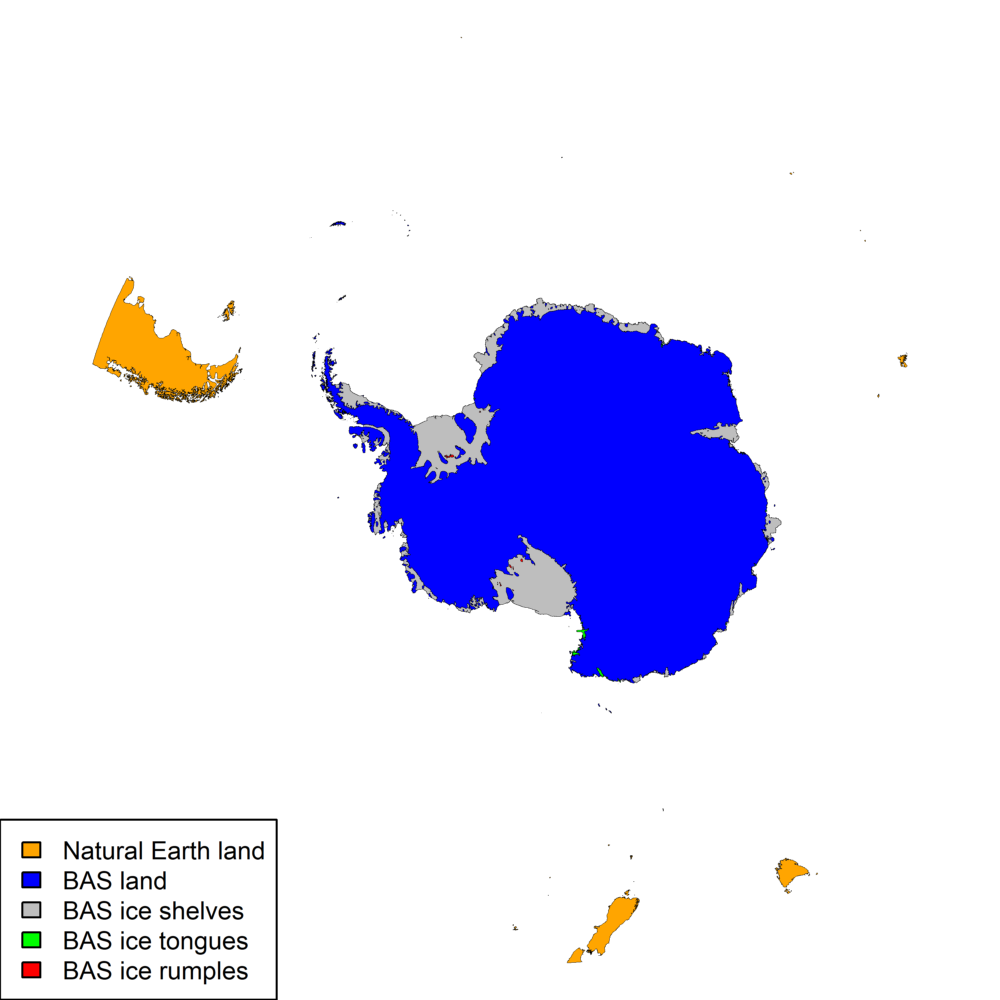
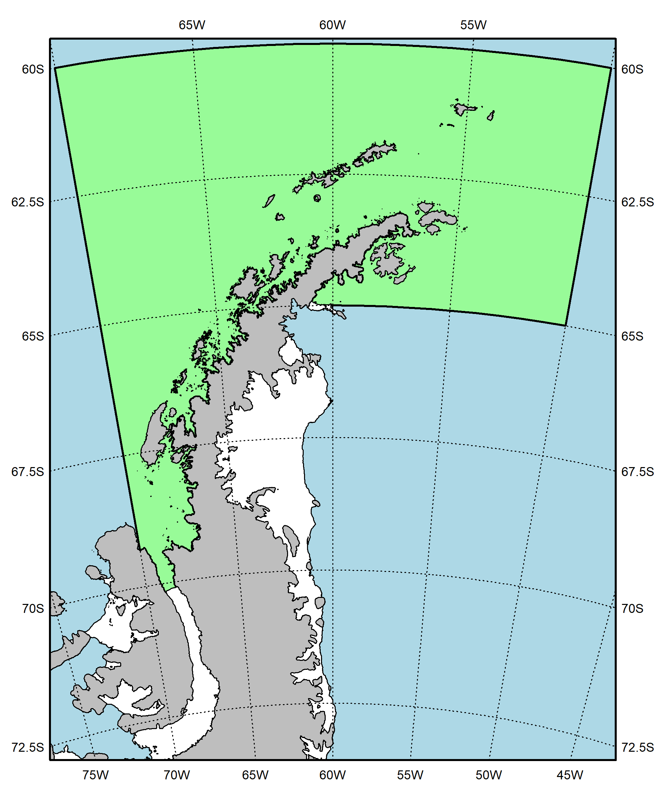
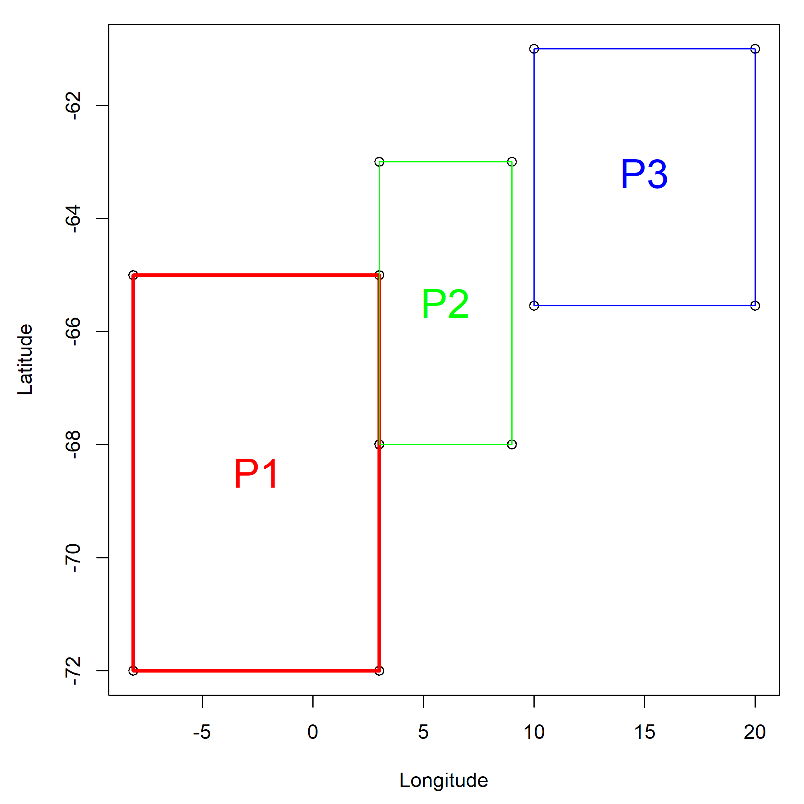
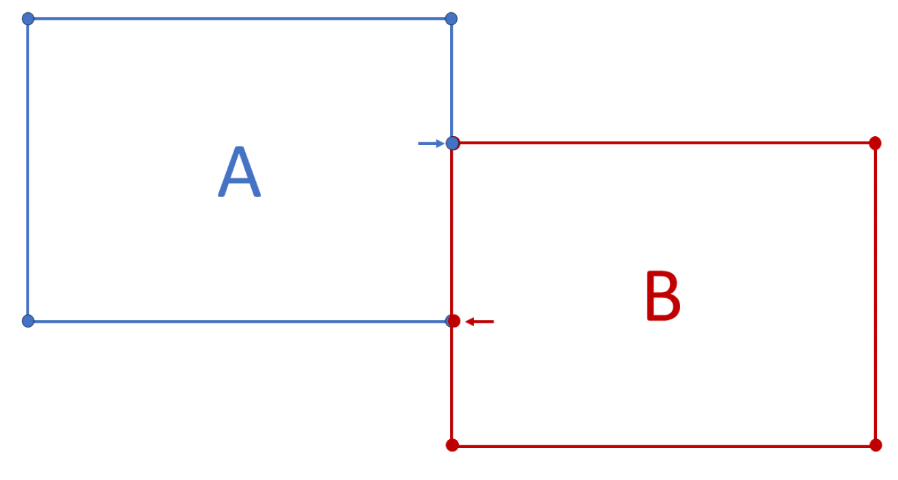
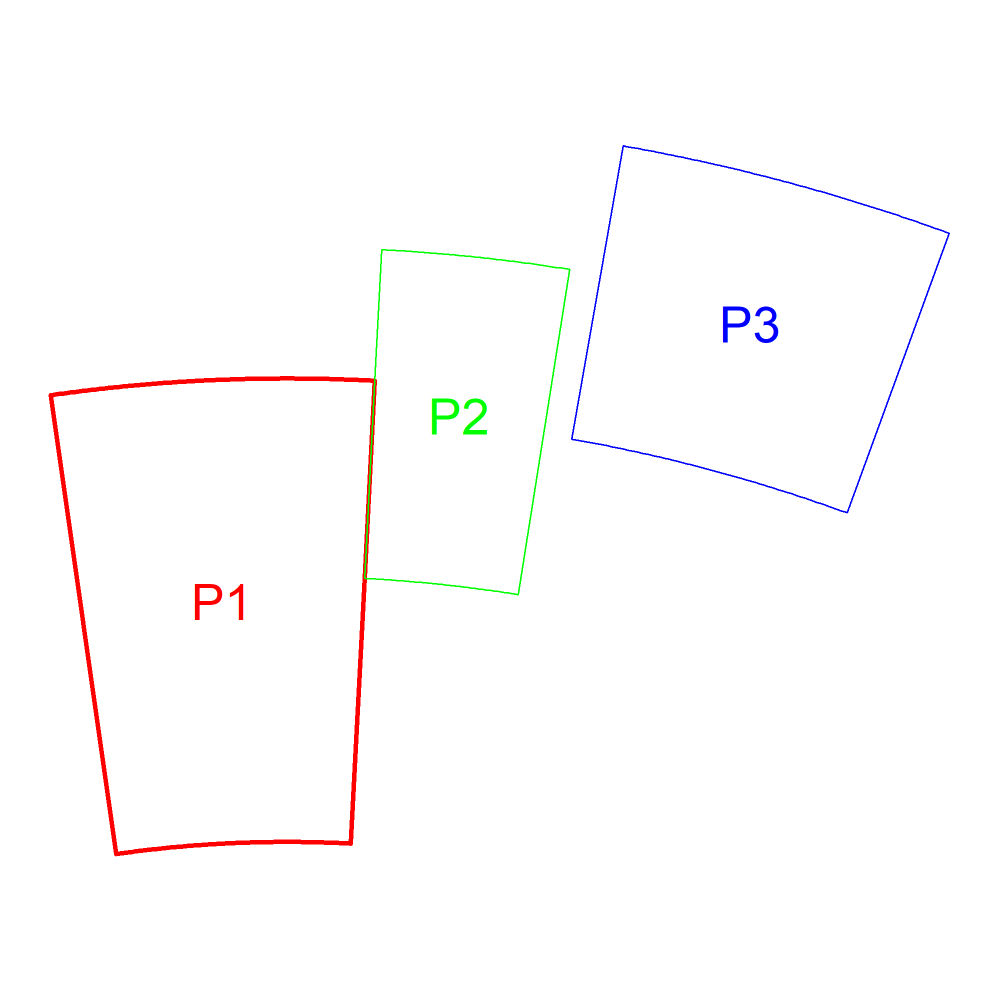
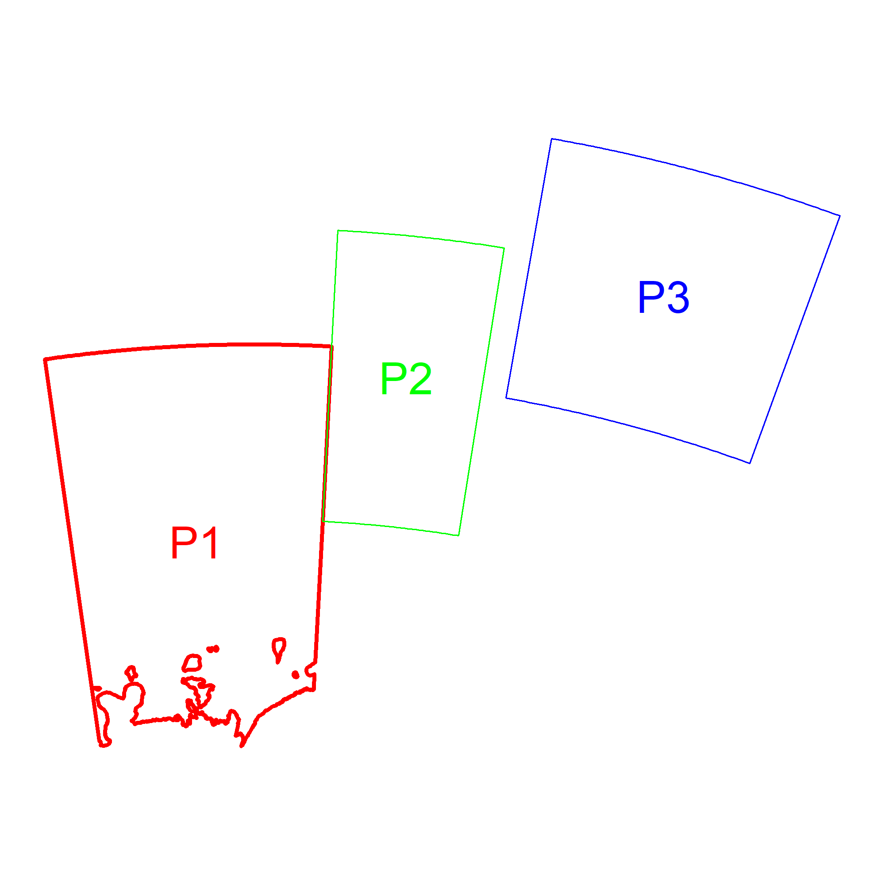
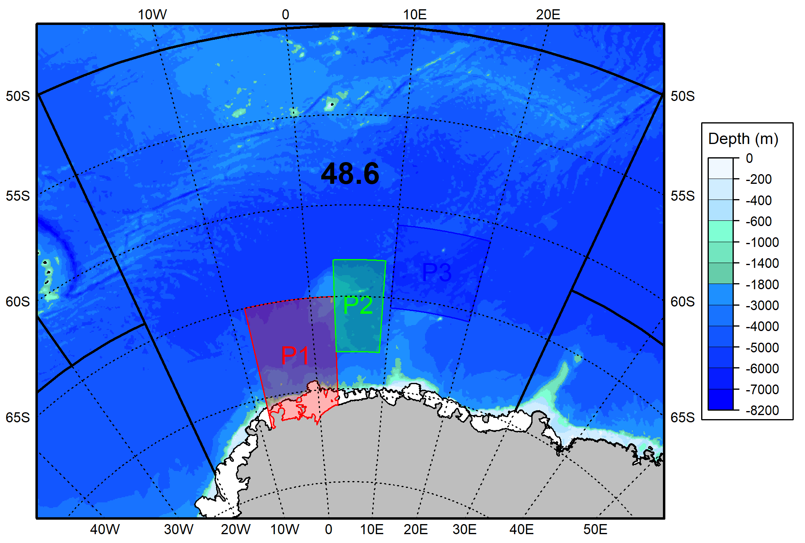

<!-- README.md is generated from README.Rmd. Please edit that file -->
<center>

# CCAMLR Geospatial Operations

</center>

------------------------------------------------------------------------

This repository contains R scripts used by the CCAMLR Secretariat to
generate spatial layers, as well as examples of their use.

<center>

### Contents

</center>

------------------------------------------------------------------------

1.  [Geospatial Rules](#1-geospatial-rules)
2.  [Coastlines](#2-coastlines)
3.  [Polygons](#3-polygons)

------------------------------------------------------------------------

<br>

### 1. Geospatial Rules

The following rules, as endorsed by the Scientific Committee in 2023
([SC-CAMLR-42]( "https://meetings.ccamlr.org/sc-camlr-42"), paragraph
2.30), will be applied throughout. The rules will be updated if
requested by the Scientific Committee.

1)  geographical information system (GIS) objects use the EPSG
    [6932](https://epsg.org/crs_6932/WGS-84-NSIDC-EASE-Grid-2-0-South.html)
    projection (*South Pole Lambert Azimuthal Equal-Area projection*),

2)  lines of more than 0.1 degree of longitude be densified,

3)  polygon vertices be given clockwise in decimal degrees with at least
    five decimal places,

4)  vertices be added where polygons meet (see
    [WG-FSA-2023](https://meetings.ccamlr.org/wg-fsa-2023) Figure 1),

5)  inland vertices be used for polygons that are bound by any coastline
    (continent and islands),

6)  polygons be clipped to all coastlines (continent and islands) based
    on the most recent available coastline data,

7)  the coastline be based on the latest available coastline data, as
    obtained from the SCAR Antarctic Digital Database (ADD) and other
    sources where needed (e.g., www.naturalearthdata.com),

8)  analyses cite CCAMLR geospatial data (i.e., shapefiles) as CCAMLR.
    (Year). Geographical data layer: (Layer name). Version (Version),
    URL: (URL),

9)  all maps cite data sources and projection used.

### 2. Coastlines

Starting in 2024, the CCAMLR Secretariat will maintain coastlines layers
produced following the Geospatial Rules. Layers from two main data
sources are used; from the [UK Polar Data
Centre](https://www.bas.ac.uk/team/business-teams/information-services/uk-polar-data-centre/)
(which generates the layers used in the [SCAR
ADD](https://www.scar.org/resources/antarctic-digital-database/)) and
from [Natural Earth](https://www.naturalearthdata.com/) (a public domain
map dataset supported by the [North American Cartographic Information
Society](https://nacis.org/)).

More specifically, four datasets are used. These are:

- High resolution vector polygons of the Antarctic coastline
  - Source: British Antarctic Survey / UK Polar Data Centre
  - Short description: Coastline and ice shelves south of 60S
  - URL:
    <https://data.bas.ac.uk/full-record.php?id=GB/NERC/BAS/PDC/01787>
  - Citation: Gerrish, L., Ireland, L., Fretwell, P., & Cooper, P.
    (2023). High resolution vector polygons of the Antarctic coastline -
    VERSION 7.8 (Version 7.8) (Data set). NERC EDS UK Polar Data Centre.
    <https://doi.org/10.5285/c7fe759d-e042-479a-9ecf-274255b4f0a1>
- Vector polygons of the Sub-Antarctic coastline
  - Source: British Antarctic Survey / UK Polar Data Centre
  - Short description: Coastline between 50S and 60S (from which the
    data between 50W and 20W is extracted)
  - URL:
    <https://data.bas.ac.uk/full-record.php?id=GB/NERC/BAS/PDC/01430>
  - Citation: Gerrish, L. (2020). Vector polygons of the Sub-Antarctic
    coastline - VERSION 7.3 (Version 1.0) (Data set). UK Polar Data
    Centre, Natural Environment Research Council, UK Research &
    Innovation.
    <https://doi.org/10.5285/c1d83502-8799-4e3c-bdca-21db6a4405d4>
- Land polygons including major islands
  - Source: Natural Earth
  - Short description: 1:10m Physical Vectors for major land masses
    (from which the data between 40S and 60S is extracted)
  - URL:
    <https://www.naturalearthdata.com/downloads/10m-physical-vectors/>
  - Citation: Made with Natural Earth. Free vector and raster map data @
    naturalearthdata.com.
- Islands that are 2 sq. km or less in size
  - Source: Natural Earth
  - Short description: 1:10m Physical Vectors for minor islands (from
    which the data between 40S and 60S is extracted)
  - URL:
    <https://www.naturalearthdata.com/downloads/10m-physical-vectors/>
  - Citation: Made with Natural Earth. Free vector and raster map data @
    naturalearthdata.com.

These data are combined, projected and simplified with a 10m tolerance
using the [CoastlineVx_x.R
script](https://github.com/ccamlr/geospatial_operations/tree/main/Scripts/Coastline).
A final set of shapefiles is produced and available here
(<https://github.com/ccamlr/data/tree/main/geographical_data>) and
through the *load_Coastline()* function of the CCAMLRGIS R package
(Version 4.0.7 and above). The following script shows how to plot the
coastline while color-coding the data sources and types:

``` r
library(CCAMLRGIS)

#Load Coastline
Coast=load_Coastline()

#Plot
png(filename="Figures/Coastline.png",width=3000,height=3000,res=600)
par(mai=rep(0,4))
plot(st_geometry(Coast[Coast$source=="Natural Earth",]),col="orange",lwd=0.01)
plot(st_geometry(Coast[Coast$source=="BAS" & Coast$layer=="Land",]),col="blue",add=T,lwd=0.01)
plot(st_geometry(Coast[Coast$layer=="Ice shelves",]),col="grey",add=T,lwd=0.01)
plot(st_geometry(Coast[Coast$layer=="Ice tongues",]),col="green",add=T,lwd=0.01)
plot(st_geometry(Coast[Coast$layer=="Ice rumples",]),col="red",add=T,lwd=0.01)
legend("bottomleft",legend=c('Natural Earth land','BAS land','BAS ice shelves','BAS ice tongues','BAS ice rumples'),
       fill=c('orange','blue','grey','green','red'),
       seg.len=0,cex=0.75,
       xpd=TRUE)
dev.off()
#> png 
#>   2
```

<div class="figure" style="text-align: center">


<p class="caption">
Figure 2.1. CCAMLR coastline with elements color-coded by source.
Sources: UK Polar Data Centre/BAS and Natural Earth. Projection: EPSG
6932.
</p>

</div>

<br>

<br>

The data contained in the shapefile is structured as follows (where
*version* is the version of the CCAMLR coastline), with a row per set of
polygons:

| id                                                | gid | version | source        | srcvrsn                                         | layer       | surface |
|:--------------------------------------------------|:----|:--------|:--------------|:------------------------------------------------|:------------|:--------|
| coastline_v1_6932.fid–1c7fb819_18d8295d306\_-3804 | NA  | 1.0     | Natural Earth | Land V5.1.1 and Minor Islands V4.1.0            | Land        | Land    |
| coastline_v1_6932.fid–1c7fb819_18d8295d306\_-3803 | NA  | 1.0     | BAS           | Ant. coastline V7.8 and Sub-Ant. coastline V7.3 | Land        | Land    |
| coastline_v1_6932.fid–1c7fb819_18d8295d306\_-3802 | NA  | 1.0     | BAS           | Ant. coastline V7.8                             | Ice shelves | Ice     |
| coastline_v1_6932.fid–1c7fb819_18d8295d306\_-3801 | NA  | 1.0     | BAS           | Ant. coastline V7.8                             | Ice tongues | Ice     |
| coastline_v1_6932.fid–1c7fb819_18d8295d306\_-3800 | NA  | 1.0     | BAS           | Ant. coastline V7.8                             | Ice rumples | Ice     |

<br>

The following script shows how to plot a specific subset of the data
(*e.g.*, for Subarea 48.1), after rotating it so that North points up:

``` r
library(CCAMLRGIS)

#Load Coastline
Coast=load_Coastline()

#Load ASDs
ASDs=load_ASDs()
#Isolate Subarea 48.1
A481=ASDs[ASDs$GAR_Short_Label=="481",] 

#Rotate objects
Lonzero=-60 #This longitude will point up
R_A481=Rotate_obj(A481,Lonzero)
R_coast=Rotate_obj(Coast,Lonzero)

#Create a bounding box for the region
bb=st_bbox(st_buffer(R_A481,10000)) #Get bounding box (x/y limits) + buffer
bx=st_as_sfc(bb) #Build spatial box to plot

#Use bounding box to crop coastline
R_coast=suppressWarnings( st_intersection(R_coast,bx) )


#Plot
png(filename='Figures/Coastline_481.png',width=2000,height=2400,res=300)
par(mai=rep(0.1,4)) #margins
plot(bx,col="lightblue")
plot(st_geometry(R_A481),border="black",lwd=2,add=T,col="palegreen")
plot(st_geometry(R_coast[R_coast$surface=="Land",]),col="grey",add=T)
plot(st_geometry(R_coast[R_coast$surface=="Ice",]),col="white",add=T)
add_RefGrid(bb=bb,ResLat = 2.5,ResLon = 5,lwd=1,fontsize = 0.75)
plot(bx,lwd=2,add=T,xpd=T)

legend(x=250000,y=2050000,
       legend=c('Subarea 48.1','Ocean','Land', 'Ice Shelves'),
       fill=c("palegreen","lightblue","grey","white"),
       xpd=T)

dev.off()
#> png 
#>   2
```

<div class="figure" style="text-align: center">


<p class="caption">
Figure 2.2. CCAMLR coastline for Subarea 48.1. Sources: UK Polar Data
Centre/BAS and Natural Earth. Projection: EPSG 6932.
</p>

</div>

<br>

<br>

More examples can be found
[here](https://github.com/ccamlr/CCAMLRGIS/blob/master/Basemaps/Basemaps.md).

### 3. Polygons

This tutorial provides step-by-step instructions to build polygons while
following the Geospatial Rules. Polygons may be used to represent areas
(*e.g.*, Research Blocks or Marine Protected Areas) or to subset data
spatially (*e.g.* finding fishing locations that fall within a chosen
area). Some of the operations used rely on the [CCAMLRGIS R
package](https://CRAN.R-project.org/package=CCAMLRGIS) which functions
may be accessed and reviewed
[here](https://github.com/ccamlr/CCAMLRGIS/tree/master/R).

#### Step 1 - Build a table of vertices

Download the [Blank Polygon
Form](https://github.com/ccamlr/geospatial_operations/tree/main/Scripts/Polygons),
which is a .csv file with three columns (*Name*, *Latitude* and
*Longitude*). While the name of these columns can be changed, these
columns must be in that order. Fill the form, one row per vertex, giving
coordinates with at least five decimal places, and clockwise. Repeat the
polygon name for each of its vertices. As an example, here is a table of
vertices for 3 polygons in Subarea 48.6 (the corresponding csv file is
[My_Polygons_Form.csv](https://github.com/ccamlr/geospatial_operations/tree/main/Scripts/Polygons)):

| Name |  Latitude | Longitude |
|:-----|----------:|----------:|
| P1   | -65.00000 |  -8.12345 |
| P1   | -65.00000 |   3.00000 |
| P1   | -72.00000 |   3.00000 |
| P1   | -72.00000 |  -8.12345 |
| P2   | -63.00000 |   3.00000 |
| P2   | -63.00000 |   9.00000 |
| P2   | -68.00000 |   9.00000 |
| P2   | -68.00000 |   3.00000 |
| P3   | -61.00000 |  10.00000 |
| P3   | -61.00000 |  20.00000 |
| P3   | -65.54321 |  20.00000 |
| P3   | -65.54321 |  10.00000 |

<br>

Plotting these coordinates as they are, and connecting them with lines
for each polygon, yields:

``` r
#Read the file
MyVertices=read.csv("Scripts/Polygons/My_Polygons_Form.csv")

#Plot
png(filename='Figures/MyPolygons0.png',width=2000,height=2000,res=300)
par(mai=c(0.9,0.9,0.2,0.2)) #margins

plot(MyVertices$Longitude,MyVertices$Latitude,xlab="Longitude",ylab="Latitude")

lines(MyVertices$Longitude[c(1:4,1)],MyVertices$Latitude[c(1:4,1)],col="red",lwd=3)
lines(MyVertices$Longitude[c(5:8,5)],MyVertices$Latitude[c(5:8,5)],col="green")
lines(MyVertices$Longitude[c(9:12,9)],MyVertices$Latitude[c(9:12,9)],col="blue")

text(-2.5,-68.5,"P1",col="red",cex=2)
text(6,-65.5,"P2",col="green",cex=2)
text(15,-63.2,"P3",col="blue",cex=2)

dev.off()
#> png 
#>   2
```

<div class="figure" style="text-align: center">


<p class="caption">
Figure 3.1. Polygon coordinates as they are given in the
‘My_Polygons_Form.csv’ file.
</p>

</div>

<br>

As seen above, polygons P1 and P2 share a boundary. Following Geospatial
Rule 4, vertices must be added where polygons meet as shown below:

<div class="figure" style="text-align: center">


<p class="caption">
Figure 3.2. Polygons A and B are each defined by four vertices and an
additional vertex at the extremity of their shared edge (arrow). Figure
taken from WG-FSA-2023 Fig. 1.
</p>

</div>

<br>

Vertices were added to the table, as indicated below:

| Name |  Latitude | Longitude |           |
|:-----|----------:|----------:|:----------|
| P1   | -65.00000 |  -8.12345 |           |
| P1   | -65.00000 |   3.00000 |           |
| P1   | -68.00000 |   3.00000 | \<= Added |
| P1   | -72.00000 |   3.00000 |           |
| P1   | -72.00000 |  -8.12345 |           |
| P2   | -63.00000 |   3.00000 |           |
| P2   | -63.00000 |   9.00000 |           |
| P2   | -68.00000 |   9.00000 |           |
| P2   | -68.00000 |   3.00000 |           |
| P2   | -65.00000 |   3.00000 | \<= Added |
| P3   | -61.00000 |  10.00000 |           |
| P3   | -61.00000 |  20.00000 |           |
| P3   | -65.54321 |  20.00000 |           |
| P3   | -65.54321 |  10.00000 |           |

<br>

#### Step 2 - Build polygons

Now that the table of vertices is complete, the
[create_Polys()](https://github.com/ccamlr/CCAMLRGIS#create-polygons)
function of the CCAMLRGIS R package can be used to create densified and
projected polygons:

``` r
library(CCAMLRGIS)

MyPolygons=create_Polys(MyVertices)

#Plot
png(filename='Figures/MyPolygons1.png',width=2000,height=2000,res=300)
par(mai=rep(0.1,4)) #margins

plot(st_geometry(MyPolygons)) #Plot all polygons to set axes limits
plot(st_geometry(MyPolygons[MyPolygons$ID=="P1",]),border="red",lwd=3,add=T)
plot(st_geometry(MyPolygons[MyPolygons$ID=="P2",]),border="green",add=T)
plot(st_geometry(MyPolygons[MyPolygons$ID=="P3",]),border="blue",add=T)

text(MyPolygons$Labx,MyPolygons$Laby,MyPolygons$ID,col=c("red","green","blue"),cex=2)

dev.off()
#> png 
#>   2
```

<div class="figure" style="text-align: center">


<p class="caption">
Figure 3.3. Densified and projected polygons.
</p>

</div>

<br>

#### Step 3 - Clip polygons to all coastlines

To clip polygons to the coastlines, use the coastline as generated in
Section 2 above. Note that the coastline dataset includes ice shelves,
while polygons must be clipped to the land:

``` r
#Load Coastline
Coast=load_Coastline()

#Isolate land and merge (union) polygons into one:
Land=Coast[Coast$surface=="Land",]
Land=st_union(Land)

#Clip polygons
MyPolygons=suppressWarnings( st_difference(MyPolygons,Land) )

#Plot
png(filename='Figures/MyPolygons2.png',width=2000,height=2000,res=300)
par(mai=rep(0.1,4)) #margins

plot(st_geometry(MyPolygons)) #Plot all polygons to set axes limits
plot(st_geometry(MyPolygons[MyPolygons$ID=="P1",]),border="red",lwd=3,add=T)
plot(st_geometry(MyPolygons[MyPolygons$ID=="P2",]),border="green",add=T)
plot(st_geometry(MyPolygons[MyPolygons$ID=="P3",]),border="blue",add=T)

text(MyPolygons$Labx,MyPolygons$Laby,MyPolygons$ID,col=c("red","green","blue"),cex=2)

dev.off()
#> png 
#>   2
```

<div class="figure" style="text-align: center">


<p class="caption">
Figure 3.4. Polygons clipped to the coastline.
</p>

</div>

<br>

#### Step 4 - Update Metadata

The spatial object that was created (*MyPolygons*) contains data in
addition to the shapes of polygons:

| ID  |  AreaKm2 |      Labx |    Laby | geometry                     |
|:----|---------:|----------:|--------:|:-----------------------------|
| P1  | 355139.0 | -107352.1 | 2399447 | POLYGON ((-390093.2 2740938… |
| P2  | 154794.3 |  284451.7 | 2706377 | POLYGON ((161468.4 2981429,… |
| P3  | 254156.2 |  765798.0 | 2857997 | POLYGON ((561536.3 3152447,… |

Each row corresponds to a polygon, the columns are:

- ID: Polygon identifier, taken from the “Name” column in the table of
  vertices,

- AreaKm2: Polygon area in square kilometers, calculated during
  creation,

- Labx and Laby: Location of polygon centers, calculated during creation
  and used to label polygons,

- geometry: POLYGON list of projected vertices (*i.e.*, the shape and
  location of polygons)

Since polygons were clipped to the coastline after their creation, their
areas and centers must be recalculated. Also, at this point, additional
information may be added in the spatial object such as a reference to
the paper describing these polygons:

``` r
#Update Areas
Ar=round(st_area(MyPolygons)/1000000,1)
MyPolygons$AreaKm2=as.numeric(Ar)
#Get labels locations
labs=st_coordinates(st_centroid(st_geometry(MyPolygons)))
MyPolygons$Labx=labs[,1]
MyPolygons$Laby=labs[,2]
#Add Reference
MyPolygons$Reference="WG-SAM-2023/xx Fig. z"
```

| ID  |  AreaKm2 |      Labx |    Laby | geometry                     | Reference             |
|:----|---------:|----------:|--------:|:-----------------------------|:----------------------|
| P1  | 317949.4 | -109064.8 | 2439867 | POLYGON ((-390093.2 2740938… | WG-SAM-2023/xx Fig. z |
| P2  | 154794.3 |  284451.7 | 2706377 | POLYGON ((161468.4 2981429,… | WG-SAM-2023/xx Fig. z |
| P3  | 254156.2 |  765798.0 | 2857997 | POLYGON ((561536.3 3152447,… | WG-SAM-2023/xx Fig. z |

<br>

#### Step 5 - Export shapefiles

The polygons are now completed and may be exported:

``` r
#Export Shapefiles
st_write(MyPolygons,"Scripts/Polygons/Completed_Polygons.shp",append = F,quiet = T)
```

Four files are generated, ending in “.dbf”, “.prj”, “.shp” and “.shx”.
These can be zipped together, shared, and submitted along with the
corresponding proposal.

#### Step 6 - Plot map

The script below provides some elements to produce a map. Other examples
are given
[here](https://github.com/ccamlr/CCAMLRGIS/blob/master/Basemaps/Basemaps.md).

``` r
library(CCAMLRGIS)
library(terra)
library(png)
#Download bathymetry:
Bathy=load_Bathy(LocalFile=F,Res=1000) #Once downloaded, re-use it. See help(load_Bathy)
# Bathy=SmallBathy() #Use this instead for testing purposes first

#Load Coastline
Coast=load_Coastline()

#Load ASDs
ASDs=load_ASDs()

#Rotate objects
Lonzero=5 #This longitude will point up
R_bathy=Rotate_obj(Bathy,Lonzero)
R_asds=Rotate_obj(ASDs,Lonzero)
R_coast=Rotate_obj(Coast,Lonzero)
R_polys=Rotate_obj(MyPolygons,Lonzero)

#Update label location after rotation
labs=st_coordinates(st_centroid(st_geometry(R_polys)))
R_polys$Labx=labs[,1]
R_polys$Laby=labs[,2]

#Select ASD of interest
R_asdsb=R_asds[R_asds$GAR_Short_Label=="486",]

#Create a bounding box for the region
bb=st_bbox(st_buffer(R_asdsb,10000)) #Get bounding box (x/y limits) + buffer
bx=st_as_sfc(bb) #Build spatial box to plot

#Use bounding box to crop elements
R_asds=suppressWarnings(st_intersection(R_asds,bx))
R_coast=suppressWarnings(st_intersection(R_coast,bx))
R_bathy=crop(R_bathy,ext(bb))


#Plot
png(filename='Figures/MyPolygons3.png',width=2000,height=1350,res=300)

plot(R_bathy,breaks=Depth_cuts2,col=Depth_cols2,
     legend=FALSE,axes=FALSE,mar=c(1,1.5,1,5.8),maxcell=5e6)
plot(st_geometry(R_asds),border="black",lwd=2,add=T)
plot(st_geometry(R_coast[R_coast$surface=="Land",]),col="grey",add=T)
plot(st_geometry(R_coast[R_coast$surface=="Ice",]),col="white",add=T)

plot(st_geometry(R_polys[R_polys$ID=="P1",]),border="red",add=T,col=rgb(1,0,0,alpha=0.3))
plot(st_geometry(R_polys[R_polys$ID=="P2",]),border="green",add=T,col=rgb(0,1,0,alpha=0.3))
plot(st_geometry(R_polys[R_polys$ID=="P3",]),border="blue",add=T,col=rgb(0,0,1,alpha=0.3))

text(R_polys$Labx,R_polys$Laby,R_polys$ID,col=c("red","green","blue"),cex=1.25)
text(0,3500000,"48.6",cex=1.5,font=2)

add_RefGrid(bb=bb,ResLat = 5,ResLon = 10,lwd=1,fontsize = 0.7)
plot(bx,lwd=2,add=T,xpd=T)

#Colorscale
add_Cscale(height=60,maxVal=-1,offset = 200,fontsize=0.65,width=15,lwd=1,
           cuts = Depth_cuts2,
           cols = Depth_cols2)

dev.off()
#> png 
#>   2
```

<div class="figure" style="text-align: center">


<p class="caption">
Figure 3.5. Map of completed polygons. Sources: CCAMLR/UK Polar Data
Centre/BAS/Natural Earth/GEBCO. Projection: EPSG 6932.
</p>

</div>

### 4. Candidate management units in Subarea 48.1

This section provides access to the resources used to update the
proposed krill fishery management units
([SC-CAMLR-41](https://meetings.ccamlr.org/sc-camlr-41), Fig. 1) and
re-calculate their area when boundaries or coastlines are updated. In
line with the Geospatial Rules and following the template provided in
[WG-ASAM-2023/01](https://meetings.ccamlr.org/wg-asam-2023/01), these
areas can be updated using the Krill_Fishery_Management_Units_Vx_x.R
\[add link\] script. This script generates the corresponding shapefiles
(see Fig. x) and a table of areas (km$^2$) for each Management Unit (see
table x).
