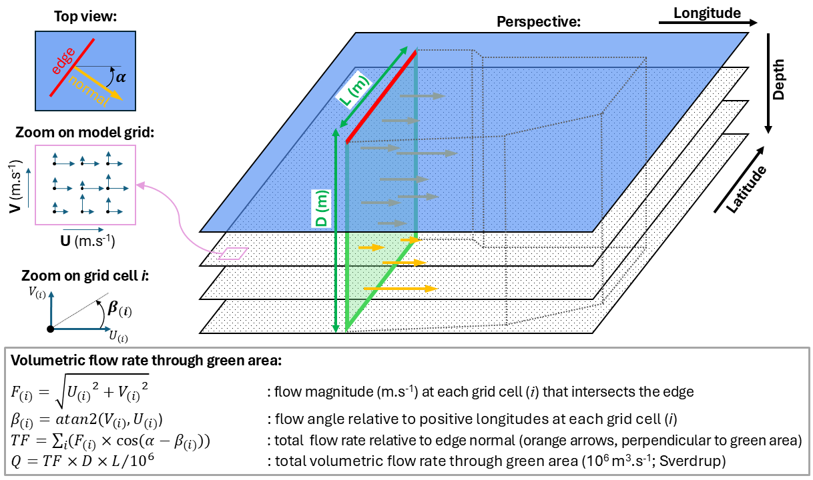
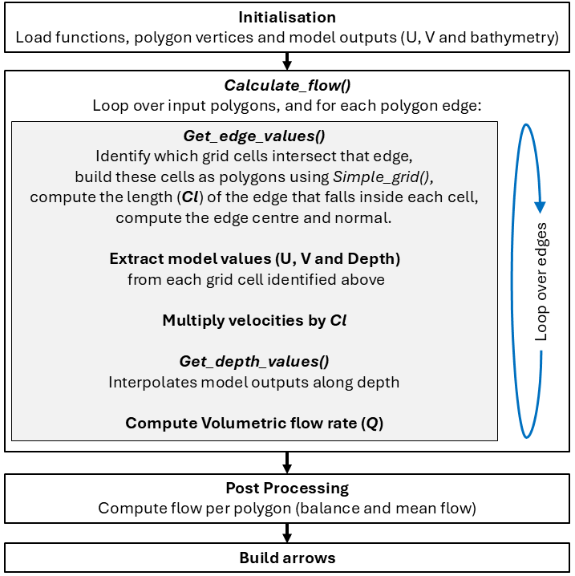
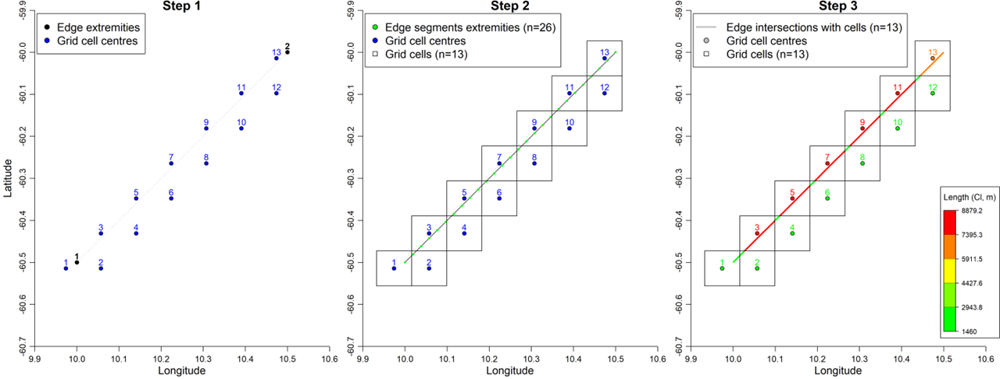
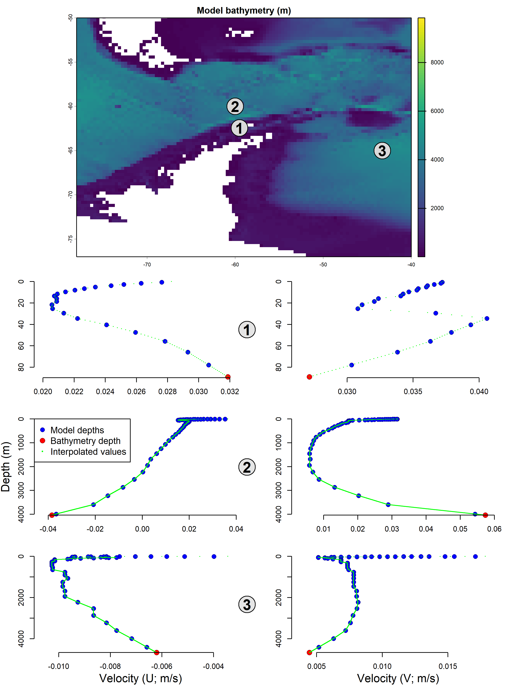
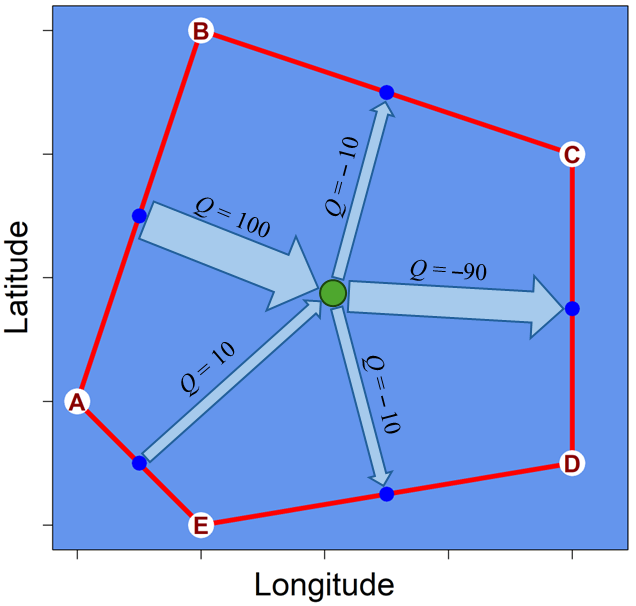
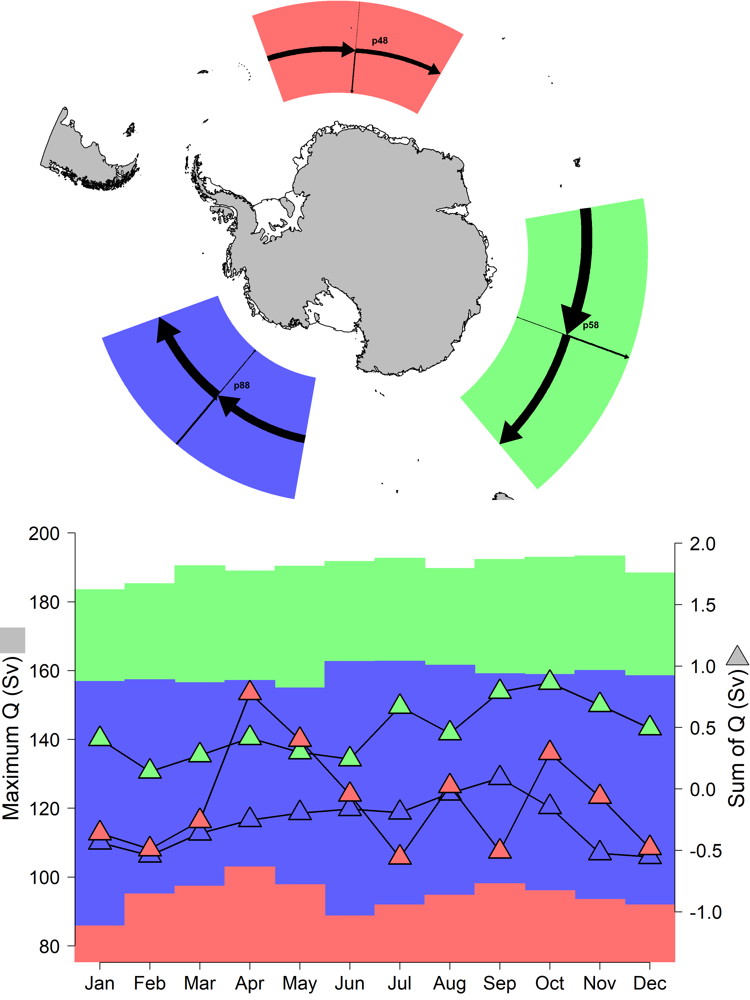
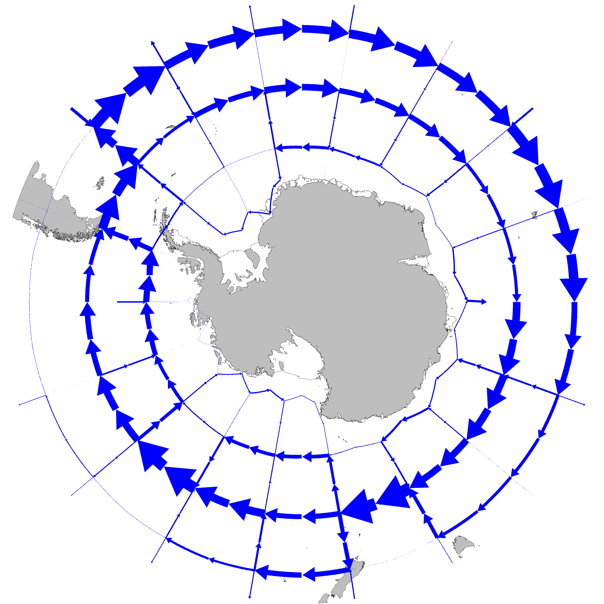

<!-- README.md is generated from README.Rmd. Please edit that file -->

# Draft method for the visualisation of oceanic currents

**Note**: This page is derived from
[WG-FSA-2026/20](https://meetings.ccamlr.org/en/wg-fsa-2026/20).

------------------------------------------------------------------------

# 1. Introduction

This page presents a draft method to build oceanic currents
visualisations using the outputs of a circulation model to inform the
direction and strength of currents, relative to arbitrary geographical
areas. By translating the high-resolution model grid into large polygons
such as CCAMLR Subareas, the method aims to build [georeferenced
arrows](https://github.com/ccamlr/CCAMLRGIS#24-create-arrow) which
directions and dimensions are defined by simulated flows across each
edge of each polygon. Taking this approach would enable generating
back-of-the-envelope flow estimates for visualisation purposes in a
simpler and quicker way than using a particle transport model.

The approach presented below is one of several potential pathways and is
only a starting point, to be built upon collaboratively. The intent is
to present the different elements of the problem using GIS-related tools
and operations, but potential alternate approaches are noted in section
4 (*[Future
work](https://github.com/ccamlr/geospatial_operations/blob/main/Scripts/Currents/Currents.md#4-future-work)*).

# 2. Methods

## 2.1. Ocean circulation model

While the method presented here should accommodate any circulation
model, the GLORYS12V1 reanalysis (Lellouche *et al.*, 2021) was selected
for its ease of access and extensive
[documentation](https://documentation.marine.copernicus.eu/PUM/CMEMS-GLO-PUM-001-030.pdf).
GLORYS12 is a global eddy-resolving physical ocean and sea ice
reanalysis at 1/12° horizontal resolution and with 50 vertical levels,
designed and implemented in the framework of the Copernicus Marine
Environment Monitoring Service ([CMEMS](https://marine.copernicus.eu/)).
Specifically, the 1993–2016 monthly climatology was used (available via
the [Copernicus Marine
Service](https://data.marine.copernicus.eu/product/GLOBAL_MULTIYEAR_PHY_001_030/files?subdataset=cmems_mod_glo_phy_my_0.083deg-climatology_P1M-m_202311)),
to establish a proof of concept. Of note, the
[documentation](https://documentation.marine.copernicus.eu/PUM/CMEMS-GLO-PUM-001-030.pdf)
indicates that output variables are interpolated from an original
[Arakawa](https://en.wikipedia.org/wiki/Arakawa_grids) C grid and given
relative to grid cell centres.

## 2.2. General overview

The core goal of this study is to estimate how much water flows through
a geographical area at a given time. Considering a
[prism](https://en.wikipedia.org/wiki/Prism_(geometry)) of ocean,
bounded at the surface by a polygon of arbitrary shape and by vertical
faces extending from the surface to the seabed (or alternatively to a
chosen depth), the goal becomes the calculation of volumetric flow rate
(or transport) across the vertical faces of this prism. Volumetric flow
rate (volume per unit time), denoted *Q*, will be here expressed in
Sverdrup (106 m3.s-1) and calculated
for each prism face bounded by a given polygon edge and depth range
(*N.B.*, dividing *Q* by area results in calculating flux, expressed in
units of volume per time per area). To account for the orientation of
the flow relative to the orientation of a given polygon edge, the normal
(*i.e.*, perpendicular) to this edge must be calculated. That is because
only the part of the current that is normal to the polygon edge carries
water across it. A schematic of these concepts is given in Figure 1.

 

Figure 1. Schematic of the calculation of volumetric flow rate (*Q*, Sv)
through one vertical face (green) of a prism of ocean (dotted lines).
The face is bounded by a given polygon edge (red segment of length L)
and depth range (D). Current velocities (U and V, m.s-1) are
taken for each model grid cell (*i*) that intersects with that edge, and
their angle relative to the edge normal (orange arrow) determined.

 

Having described the operations pertaining to a single polygon edge
(*i.e.*, a face of the ocean prism), Figure 2 below provides an overview
of the workflow used to calculate *Q* across each edge of a given
polygon, summarise results (*e.g.*, compute the balance of flows across
edges), and use *Q* to scale georeferenced arrows for that polygon.

 

Figure 2. Diagram of the workflow used to build georeferenced arrows
that are scaled by the volumetric flow rate (*Q*) passing through a
prism of ocean defined by a given polygon at the surface. All
computations are done using R, and specific R functions are identified
in italics and with brackets (*e.g.*,
*[Calculate_flow()](https://github.com/ccamlr/geospatial_operations/blob/main/Scripts/Currents/Code/Functions.R#L4)*).

 

All R scripts are available in this repository, please refer to [Folder
structure and R
scripts](https://github.com/ccamlr/geospatial_operations/blob/main/Scripts/Currents/Currents.md#folder-structure-and-r-scripts)
for details. Among others, the following R libraries were used: *sf*
(Pebesma, 2018; Pebesma and Bivand, 2023); *terra* (Hijmans *et al.*,
2026); *dplyr* (Wickham *et al.*, 2026) and *CCAMLRGIS* (Thanassekos *et
al.*, 2026). The following sections provide details on each element of
the workflow.

 

## 2.3. Flow along edge

This part of the workflow is likely where most future refinements or
alternatives could be applied in the future. The simple approach
presented here relies on geospatial operations using GIS tools, chosen
to help visualise the steps that are followed. Other more complex
approaches may be more accurate and should be investigated. The
operations are executed by the function
*[Get_edge_values()](https://github.com/ccamlr/geospatial_operations/blob/main/Scripts/Currents/Code/Functions.R#L92)*
(see Fig. 2), which follows four steps:

1.  Identify grid cells that intersect the polygon edge,

2.  densify that edge (add intermediate vertices between extremities) to
    enable splitting it into small segments as intersections between the
    edge and each grid cell. This requires building grid cells as
    individual polygons, and would need adjustments if other types of
    [Arakawa](https://en.wikipedia.org/wiki/Arakawa_grids) grids were
    used,

3.  calculate the length of edge segments (denoted *Cl* in Fig. 2 and
    colour-coded in Step 3 of Fig. 3),

4.  calculate the edge normal (perpendicular to the edge, expressed as
    the angle relative to increasing longitudes).

These four steps are schematised in the following two figures. The first
figure (Fig. 3) was made using
*[Demo_Edge_Values.R](https://github.com/ccamlr/geospatial_operations/blob/main/Scripts/Currents/Demos/Demo_Edge_Values.R)*
and the second one (Fig. 4) using
*[Demo_Angle_and_UV.R](https://github.com/ccamlr/geospatial_operations/blob/main/Scripts/Currents/Demos/Demo_Angle_and_UV.R)*.
Both scripts are available in the
[Demos](https://github.com/ccamlr/geospatial_operations/blob/main/Scripts/Currents/Demos/Demos.md)
folder of the repository.

 

Figure 3. Steps 1–3 followed by
*[Get_edge_values()](https://github.com/ccamlr/geospatial_operations/blob/main/Scripts/Currents/Code/Functions.R#L92)*
(see text) to split a given polygon edge into segments that fall inside
each circulation model grid cell, and to calculate their lengths (*Cl*).

 

Figure 4. Step 4 followed by
*[Get_edge_values()](https://github.com/ccamlr/geospatial_operations/blob/main/Scripts/Currents/Code/Functions.R#L92)*
(see text) to calculate edge normals (perpendiculars to edges; orange
arrows). Given a velocity from the circulation model (blue arrow), this
enables projecting that velocity onto the edge (here arbitrarily placed
on the center of the edge; blue circle) while accounting for the
relative angle of that velocity and that edge. If polygon vertices are
given in a clockwise order (left; as they are in this study), flows
pointing towards the inside of the polygon will be positive (*Q*\>0;
green arrows) and others will be negative (*Q*\<0; pink arrows). The
opposite is true if vertices are given counterclockwise (right).

 

Following these steps provides the grid cell indices of the circulation
model (which will then be used to extract model outputs at these
locations at any depth), the length of the portion of the edge that
falls inside each grid cell (*Cl*), and the angle of the edge normal. By
multiplying these lengths (*Cl*) by the model velocities for each of
these cells, the method accounts for how much overlap there is between
the edge and the cells (to integrate values horizontally more accurately
than the simple *TF*×*L* shown in Fig. 1).

 

## 2.4. Flow along depth

The integration of velocities along depths is executed by the function
*[Get_depth_values()](https://github.com/ccamlr/geospatial_operations/blob/main/Scripts/Currents/Code/Functions.R#L179)*
which performs a linear (regularly spaced) interpolation between the
(irregularly spaced) depths of the model layers and linear
extrapolations to two additional points: one at the surface and one at
the seabed (Fig. 5). The seabed depth is taken from the model bathymetry
data at each location of interest (*i.e.*, for the cells identified in
Step 1 above). It must be noted that on some occasions, the model
appeared to have velocity values below the bathymetry depth (which were
ignored) and that no attempts were made to account for partial cells
(which occur when the bathymetry is shallower than the next deeper layer
in the model); this may have large impacts in some areas and will
require refinement in the future.

Figure 5. Example of depth integration for three arbitrary locations (A:
59.5°W\|62.45°S; B: 60°W\|60°S; C: 43.3°W\|65°S). Velocities (left: U;
right: V) are linearly interpolated (green dots) from the surface,
through the model depths (blue circles), down to the depth of the model
bathymetry (red dots and top map).

 

## 2.5. Scaling arrows by flows

Once flow (*Q*) has been computed for each edge of a polygon (or prism
face), the
*[create_Arrow()](https://github.com/ccamlr/CCAMLRGIS#24-create-arrow)*
function of the
[CCAMLRGIS](https://github.com/ccamlr/CCAMLRGIS#ccamlrgis-r-package)
package is used to build georeferenced arrows for mapping purposes. That
function is used within the
*[Arrow_Maker()](https://github.com/ccamlr/geospatial_operations/blob/main/Scripts/Currents/Code/Functions.R#L313)*
function to build arrows which width is scaled by *Q* and orientation is
defined by the middle of the edge and the centre of the polygon. The
direction of the arrow is controlled by the sign of *Q* (see also Fig.
4): if *Q* is positive, the arrow goes from the edge to the polygon
centre, if *Q* is negative, the arrow goes from the polygon centre to
the edge (Fig. 6).

Figure 6. Schematic of the scaling and direction of arrows (pale blue)
by the flow (*Q*) passing through each edge (red). If *Q* is positive
the arrow goes from the edge middle (blue circle) to the polygon centre
(green circle), otherwise that direction is reversed.

 

## 2.6. Preliminary experiments

Using the workflow described above, three preliminary experiments were
conducted, the first two being used to ensure that its underlying
approximations do not result in entirely wrong *Q* estimates:

- Experiment 1: compute *Q* for selected geographical sections for which
  flow estimates have been published (*e.g.*, the Drake passage),

- Experiment 2: compute *Q* for a large polygon in each of the FAO Areas
  (48, 58 and 88) and sum values to verify whether flows are balanced
  (the sum of per-edge *Q* from the surface to the seabed should equal
  zero for each polygon),

- Experiment 3: compute *Q* for a circumpolar grid with cells of 10°
  latitude by 20° longitude to visualise currents at the scale of the
  Convention Area.

In these experiments, flows were calculated by integrating model outputs
from the surface to the seabed, but a different depth range could be
used if desired (except for the purpose of balance verification). Since
the circulation model outputs are monthly means over the period
1993–2016, the overall mean across months was calculated when a single
value was desired.

# 3. Results

 

The results of the three experiments are presented below (Figs 7–9).

Considering volumetric flow rates (*Q*) across selected transects (Fig.
7), our estimates are generally greater than the published ones,
particularly for the section between South Africa and Antarctica. Apart
from the use of different model configurations across published
estimates, such discrepancy could be due to a range of issues including
(i) the approximations (*e.g.*, the handling of partial cells at the
seabed) and potential presence of one or more errors in our approach,
(ii) the different method used to calculate *Q* for published values
(although this is difficult to ascertain as this step is seldom
described in publications), and/or (iii) the different temporal pooling
of model outputs: we used monthly climatologies while Lellouche *et al.*
(2021) likely computed daily – or possibly five day intervals – values
which were subsequently averaged.

 

Figure 7. Experiment 1 – Comparison of volumetric flow rates (*Q*, Sv)
for three transects (Drake passage: from 68°W\|54.5°S to 60°W\|64.7°S;
South Africa: along 30°E from 32.5°S to 70°S; Tasmania: along 147.5°E
from 44°S to 68°S). blue, orange and red numbers correspond to published
estimates (GLORYS12: CMEMS reanalysis; F12: without data assimilation;
G4: 1/4° resolution; see Lellouche *et al.*, 2021 for details) and black
numbers correspond to this study (including the standard deviations of
monthly values in parentheses). Figure modified from figure 7 of
Lellouche *et al.*, 2021.

 

Regarding the verification of flow balances in three large arbitrary
polygons (Fig. 8), imbalances (when the sum of *Q* is not zero) may stem
from the points raised above, but most likely from the approximations
used in our workflow. That being said, the largest *Q* imbalance of 0.86
Sv in October in Area 58 (green) corresponds to only 0.45% of the
largest edge flow in that polygon (193.05 Sv). The worst imbalance (0.78
Sv) in April in Area 48 (red) corresponds to 0.76% of the largest edge
flow in that polygon (103.07 Sv).

 

Figure 8. Experiment 2 – Verification of flow (*Q*) balance for three
large polygons (red: p48; green: p58; and blue: p88). The colour-coded
histograms indicate the maximum flow found on an edge of each polygon
(left y axis) and the triangles correspond to the sum of flows across
edges for each polygon (right y axis), in each month. If the sum of
flows is greater than zero, more water enters the polygon than exits it.

 

Finally, the visualisation of circumpolar flows (Fig. 9) seems to be
consistent with general expectations but could be improved by merging
arrows with similar dimensions and orientations, and potentially by
assembling a more strategic collection of polygons than a simple regular
grid. Such cosmetic improvements will be considered once flow
calculations are verified and better validated in the future.

 

Figure 9. Experiment 3 – circumpolar flows (mean of monthly estimates)
in a grid with cells of 10° latitude by 20° longitude.

 

# 4. Future work

In addition to any future work suggested by any interested individual,
the following potential tasks may be beneficial:

- Investigate alternative ways to calculate flows such as (i) an
  approach where polygon edges are converted into a succession of
  segments aligned with the model grid (this would approximate the
  polygon edge but enable a simpler use of U and V velocities), and
  (ii), an approach where velocity fields are interpolated in three
  dimensions: along depth (as we did) but also along the polygon edge,
  resulting in a 3D model of flow for each face of the ocean prism,

- request feedback from relevant external experts (maintainers of
  dependent R packages to ensure we are using them in the best way
  possible, modellers from Copernicus to verify whether we are using
  their model outputs appropriately, as well as other GIS experts and
  oceanographers),

- test the methods using different circulation models,

- improve the handling of partial cells (model layers interrupted by the
  seabed),

- use parallel computation to speed-up calculations,

- improve visualisations by merging arrows and designing a better
  collection of polygons (potentially using isobaths).

 

### References

Hijmans R, et al., 2026. terra: Spatial Data Analysis.
<doi:10.32614/CRAN.package.terra>. R package version 1.9-46.

Lellouche, J.-M. et al., 2021. The Copernicus Global 1/12° Oceanic and
Sea Ice GLORYS12 Reanalysis. Front. Earth Sci. 9:698876.
<https://doi.org/10.3389/feart.2021.698876>.

Pebesma, E., 2018. Simple Features for R: Standardized Support for
Spatial Vector Data. The R Journal 10 (1), 439-446,
<https://doi.org/10.32614/RJ-2018-009>.

Pebesma, E., and Bivand, R., 2023. Spatial Data Science: With
Applications in R. Chapman and Hall/CRC.
<https://doi.org/10.1201/9780429459016>.

Thanassekos S, et al., 2026. CCAMLRGIS: Antarctic Spatial Data
Manipulation. <a href="https://doi:10.32614/CRAN.package.CCAMLRGIS"
class="uri">https://doi:10.32614/CRAN.package.CCAMLRGIS</a>. R package
version 4.3.1.

Wickham H, et al., 2026. dplyr: A Grammar of Data Manipulation.
<a href="https://doi:10.32614/CRAN.package.dplyr"
class="uri">https://doi:10.32614/CRAN.package.dplyr</a>. R package
version 1.2.1.

 

# Folder structure and R scripts

- [Code](https://github.com/ccamlr/geospatial_operations/tree/main/Scripts/Currents/Code)
  All the R scripts used in this study:

  - Inputs:
    [Links](https://github.com/ccamlr/geospatial_operations/blob/main/Scripts/Currents/Code/Inputs/InputsForCurrents.md)
    to Copernicus files that need to be downloaded. Place them in that
    folder for the scripts to work as intended.

  - Outputs: where scripts export their outputs.

  - 01_Example.R: a simple example of flow calculation for an arbitrary
    polygon, using June velocities.

  - 02_Flows.R: complete script of flow calculations, including setup
    for all [3
    experiments](https://github.com/ccamlr/geospatial_operations/blob/main/Scripts/Currents/Currents.md#26-preliminary-experiments).

- [Demos](https://github.com/ccamlr/geospatial_operations/blob/main/Scripts/Currents/Demos/Demos.md)
  Demo scripts mentioned in this page

- [Figs](https://github.com/ccamlr/geospatial_operations/tree/main/Scripts/Currents/Figs)
  All the figures shown in this page
