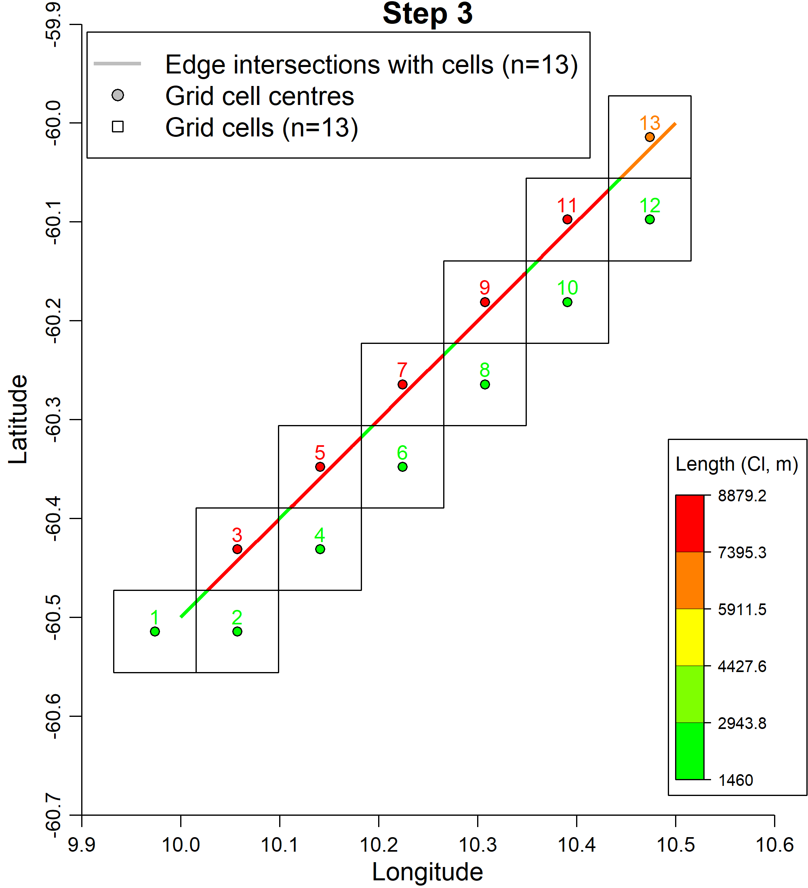
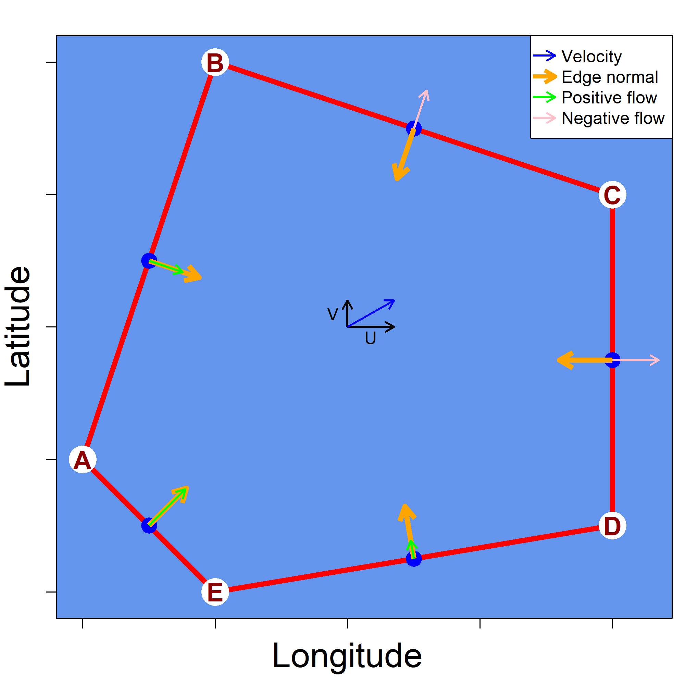

<!-- README.md is generated from README.Rmd. Please edit that file -->

```{r, echo = FALSE}
library(knitr)
knitr::opts_chunk$set(
  collapse = TRUE,
  comment = "#>"
)
```

[main document]:https://github.com/ccamlr/geospatial_operations/blob/main/Scripts/Currents/Currents.md#draft-method-for-the-visualisation-of-oceanic-currents

# Demos of the draft method for the visualisation of oceanic currents

<br>

*N.B.*: Demo 1 and 3 require Copernicus inputs (see [here](https://github.com/ccamlr/geospatial_operations/blob/main/Scripts/Currents/Code/Inputs/InputsForCurrents.md)).

<br>


## Demo 1 -- Get_edge_values (Fig. 3)

The script [Demo_Edge_Values.R](https://github.com/ccamlr/geospatial_operations/blob/main/Scripts/Currents/Demos/Demo_Edge_Values.R) was used to produce Fig. 3 of the [main document]. See example below:

```{r fig.align="center",out.width="50%",message=F,dpi=300,echo=F,eval=T,fig.cap="Figure 1. Output of Demo_Edge_Values.R"}

```

<br>

## Demo 2 -- Determining normals to polygon edges (Fig. 4)

The script [Demo_Angle_and_UV.R](https://github.com/ccamlr/geospatial_operations/blob/main/Scripts/Currents/Demos/Demo_Angle_and_UV.R) was used to produce Fig. 4 of the [main document]. See example below:


```{r fig.align="center",out.width="50%",message=F,dpi=300,echo=F,eval=T,fig.cap="Figure 2. Output of Demo_Angle_and_UV.R"}

```

<br>

## Demo 3 -- Get_depth_values (Fig. 5)

The script [Demo_Get_depths.R](https://github.com/ccamlr/geospatial_operations/blob/main/Scripts/Currents/Demos/Demo_Get_depths.R) was used to produce Fig. 5 of the [main document]. See example below:

```{r fig.align="center",out.width="70%",message=F,dpi=300,echo=F,eval=T,fig.cap="Figure 3. Output of Demo_Get_depths.R"}
include_graphics("Get_Depths.png")
```
