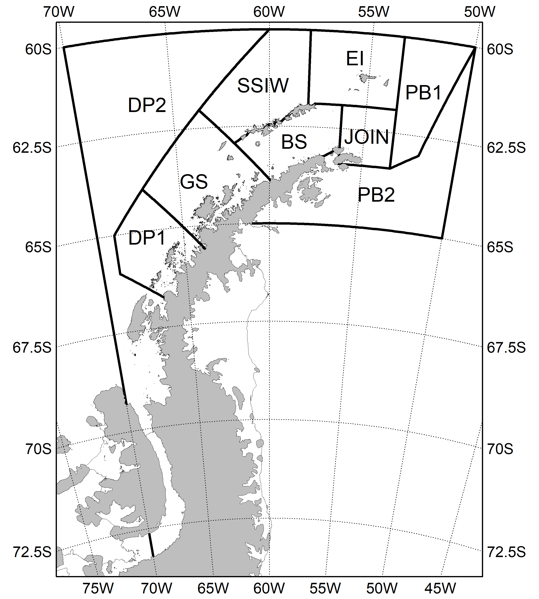
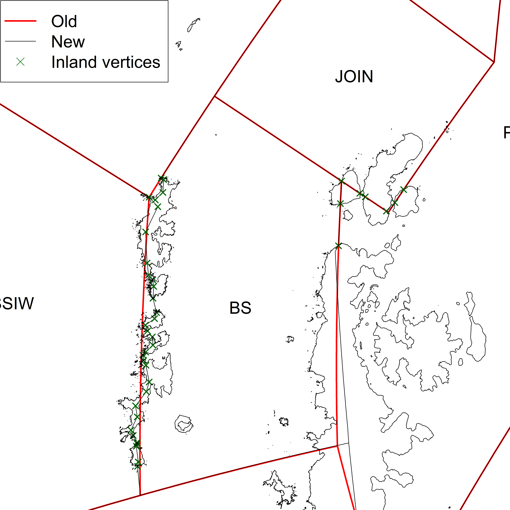
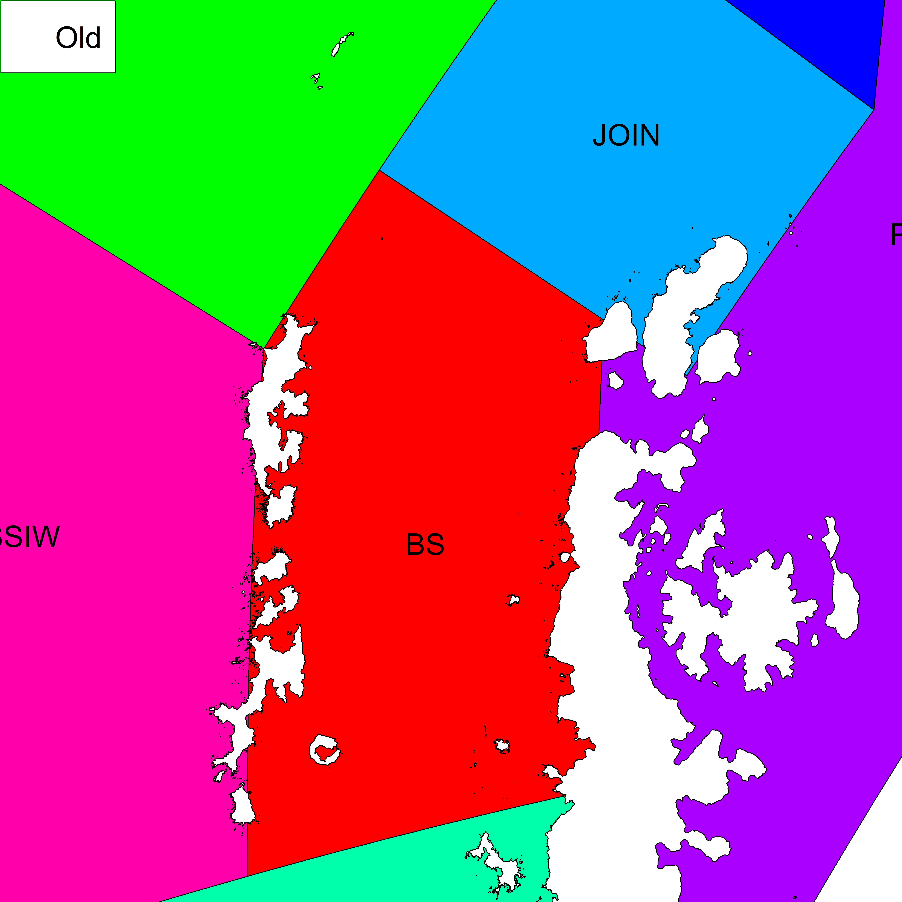
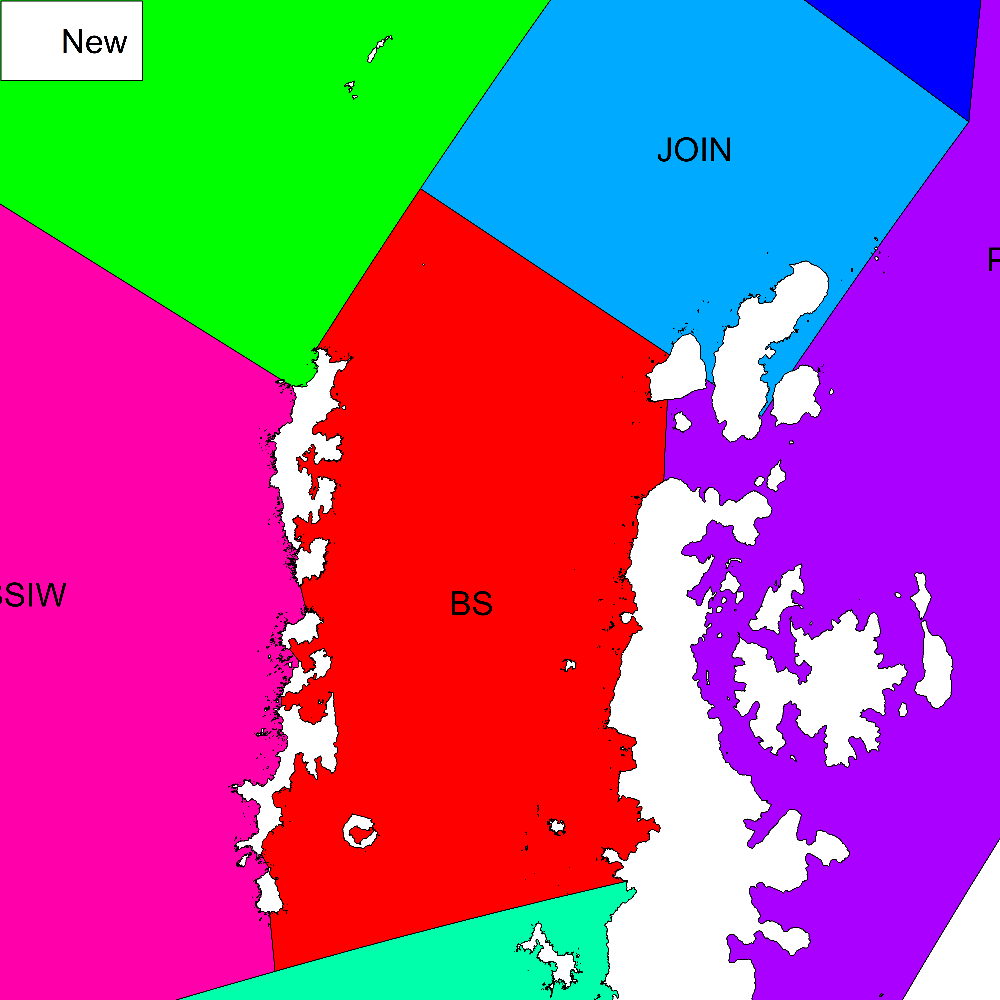

<!-- README.md is generated from README.Rmd. Please edit that file -->

```{r, echo = FALSE}
library(knitr)
knitr::opts_chunk$set(
  collapse = TRUE,
  comment = "#>"
)
```


# Candidate Krill Fishery Management Units - V3

[SC-CAMLR-41]:https://meetings.ccamlr.org/sc-camlr-41
[WG-EMM-2024]:https://meetings.ccamlr.org/wg-emm-2024 
[KFMUs_V1]:https://github.com/ccamlr/geospatial_operations/tree/main/Scripts/Krill_Fishery_Management_Units/KFMUs_V1
[KFMUs_V2]:https://github.com/ccamlr/geospatial_operations/tree/main/Scripts/Krill_Fishery_Management_Units/KFMUs_V2
[SC-CAMLR-43]:https://meetings.ccamlr.org/sc-camlr-43

*Previous versions*:

- V1: as presented in Fig. 1 of [SC-CAMLR-41]. All files are in the [KFMUs_V1] folder.

- V2: as presented in Figs. 2--8 of [WG-EMM-2024] and endorsed by the Scientific Committee in 2024 ([SC-CAMLR-43], paragraph 2.63). All files are in the [KFMUs_V2] folder.

<br>

[here]:https://github.com/ccamlr/geospatial_operations/tree/main/Dataset/GeoPackages
[geospatial dataset]:https://github.com/ccamlr/geospatial_operations/blob/main/Documentation/Dataset.md#dataset
[Plot_Krill_Fishery_Management_Units_V3.R]:https://github.com/ccamlr/geospatial_operations/blob/main/Scripts/Krill_Fishery_Management_Units/KFMUs_V3/Plot_Krill_Fishery_Management_Units_V3.R

This latest version contains some adjustments to vertices at the boundary between SSIW and BS (a series of islands *e.g.*, Livingston; Greenwich; Robert; Nelson; King George etc…). The structure of the file has also been modified to align with the updated [geospatial dataset]. The figures below (Figs. 2--5) show the comparison between the previous and the new polygons. Figure 1 was generated with the R script contained on this page ([Plot_Krill_Fishery_Management_Units_V3.R]), using the geospatial data from [here].

<br>

```{r fig.align="center",out.width="100%",message=F,dpi=300,echo=F,eval=T,fig.cap="Figure 1. Candidate Krill Fishery Management Units after update. EI: Elephant Island, JOIN: Joinville, BS: Bransfield Strait, SSIW: South Shetland Islands West, GS: Gerlache Strait, DP: Drake Passage, PB: Powell Basin. Sources: CCAMLR/UK Polar Data Centre/BAS and Natural Earth. Projection: EPSG 6932 (rotated)."}

```

<br>

```{r fig.align="center",out.width="70%",message=F,dpi=300,echo=F,eval=T,fig.cap="Figure 2. Comparison of old (V2) and new (V3) polygons."}
include_graphics("Fig02.png")
```

<br>

```{r fig.align="center",out.width="70%",message=F,dpi=300,echo=F,eval=T,fig.cap="Figure 3. Comparison of old (V2) and new (V3) polygons, and visualisation of additional inland vertices used in V3 (green crosses)."}

```

<br>

```{r fig.align="center",out.width="70%",message=F,dpi=300,echo=F,eval=T,fig.cap="Figure 4. Old (V2) polygons."}

```

<br>

```{r fig.align="center",out.width="70%",message=F,dpi=300,echo=F,eval=T,fig.cap="Figure 5. New (V3) polygons."}

```
