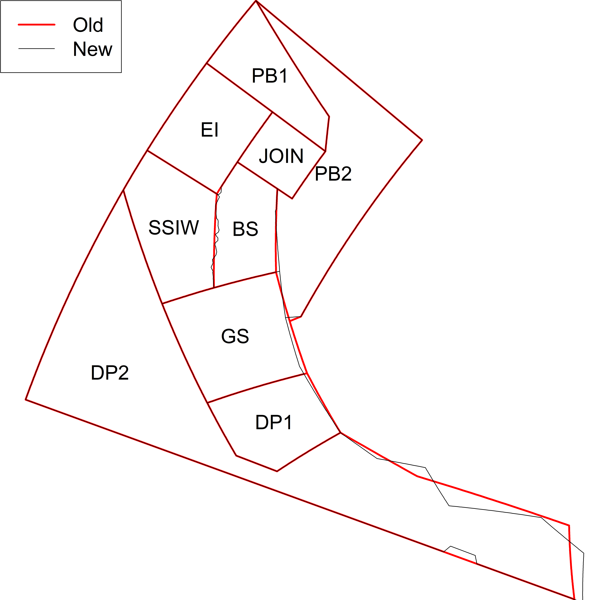

<!-- README.md is generated from README.Rmd. Please edit that file -->

```{r, echo = FALSE}
library(knitr)
knitr::opts_chunk$set(
  collapse = TRUE,
  comment = "#>"
)
```


# Candidate Krill Fishery Management Units - V3

[here]:https://github.com/ccamlr/geospatial_operations/tree/main/Dataset/GeoPackages
[geospatial dataset]:https://github.com/ccamlr/geospatial_operations/blob/main/Documentation/Dataset.md#dataset
[Plot_Krill_Fishery_Management_Units_V3.R]:https://github.com/ccamlr/geospatial_operations/blob/main/Scripts/Krill_Fishery_Management_Units/KFMUs_V3/Plot_Krill_Fishery_Management_Units_V3.R

This latest version contains some adjustments to vertices at the boundary between SSIW and BS (a series of islands *e.g.*, Livingston; Greenwich; Robert; Nelson; King George etc…). The structure of the file has also been modified to align with the updated [geospatial dataset]. The figures below (Figs. 2--5) show the comparison between the previous and the new polygons. Figure 1 was generated with the R script contained on this page ([Plot_Krill_Fishery_Management_Units_V3.R]), using the geospatial data from [here].

```{r fig.align="center",out.width="80%",message=F,dpi=300,echo=F,eval=T,fig.cap="Figure 2. Test."}

```
