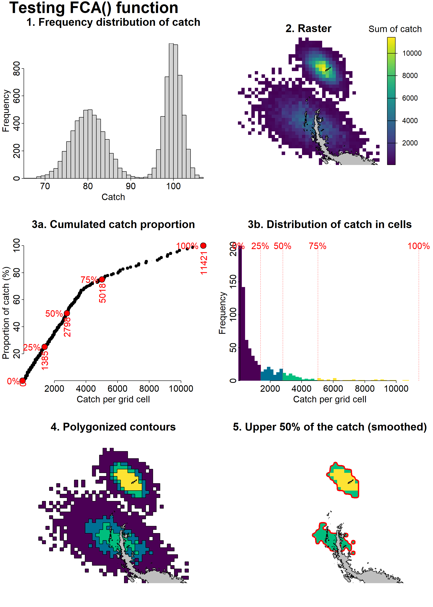
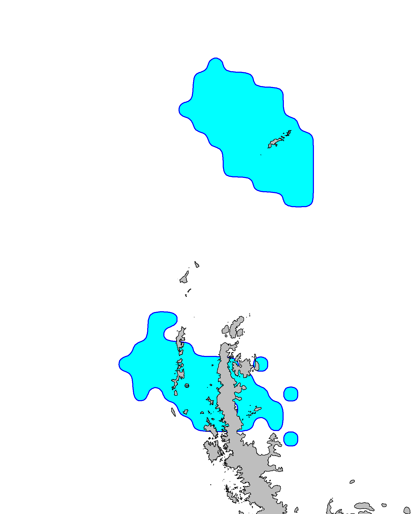

<!-- README.md is generated from README.Rmd. Please edit that file -->

<center>

# Tools

</center>

While the
[CCAMLRGIS](https://github.com/ccamlr/CCAMLRGIS#ccamlrgis-r-package) R
package offers many geospatial tools, this page documents analytical
resources that have been developed by the Secretariat to address
specific CCAMLR needs. While these are described here, they may also be
found in the [CCAMLR Science
Toolbox](https://ccamlr-science.github.io/Toolbox/) which further offers
non-GIS analytical tools that have been developed over the years.

<center>

### Contents

</center>

------------------------------------------------------------------------

1.  [Fishery Distribution Metrics](#1-fishery-distribution-metrics)

    1.1. [Fishery Concentration Index](#11-fishery-concentration-index)

    1.2. [Fishery Concentration Areas](#12-fishery-concentration-areas)

2.  [Acoustic Survey Design](#2-acoustic-survey-design)

------------------------------------------------------------------------

### 1. Fishery Distribution Metrics

#### 1.1. Fishery Concentration Index

Introduced in [SC-CAMLR-44/BG/36
Rev. 2](https://meetings.ccamlr.org/en/sc-camlr-44/bg/36-rev-2), the
Fishery Concentration Index was designed to visualise temporal trends in
spatial concentration of catches. It is calculated as the sum of catches
divided by the area of the fished footprint (*e.g.*, in tonnes per
square km), within a defined period and area. To compute the area of the
fished footprint, a fished path is considered as a straight line between
the start and end locations of the fishing event, and is buffered by a
chosen distance (typically 10s of meters) to represent the area that was
fished along that path. This buffer distance can be adjusted depending
on the fishing gear used. Depending on the fishery, fished footprints
may be merged or not, prior to the calculation of the Index
(sum(catch)/sum(area)). For instance, because the krill fishery is a
pelagic fishery with water and krill in motion, the trawl paths are
treated as non-overlapping and footprints are not merged.

The calculation of the Fishery Concentration Index was written in an R
function called
[FCI()](https://github.com/ccamlr/geospatial_operations/blob/main/Scripts/Fishery%20Distribution%20Metrics/FCI.R),
and a demonstration of its use is given below.

``` r
#Fishery Concentration Index demo with simulated data
#Load Fishery Concentration Index function
source(paste0(Pth,"Scripts/Fishery Distribution Metrics/FCI.R"))

#Generate some data
N=20 #Number of lines/trawls
Input=data.frame(Lat_Start=rnorm(n=N,mean=-62,sd=1),
                 Lon_Start=rnorm(n=N,mean=-60,sd=1),
                 Lat_End=rnorm(n=N,mean=-62,sd=1),
                 Lon_End=rnorm(n=N,mean=-60,sd=1),
                 Catch=rnorm(n=N,mean=100,sd=3),
                 Width=runif(n=N,min=1000,max=10000)) #Width could be constant


#Run FCI() without merging tracks
FCI_1=FCI(Input)
FCI_1
#> [1] 0.1714223

#Run FCI() with merging tracks
FCI_2=FCI(Input,MergeB=T)
FCI_2
#> [1] 0.1846579
```

#### 1.2. Fishery Concentration Areas

Introduced in [SC-CAMLR-44/BG/36
Rev. 2](https://meetings.ccamlr.org/en/sc-camlr-44/bg/36-rev-2), the
Fishery Concentration Areas workflow was designed to visualise spatial
trends in concentration of catches. In short, catch data are gridded,
grid cells are ordered by their catch, and their cumulative sum used to
select cells based on a chosen proportional threshold of total catch.
For example, those grid cells with the highest catch and corresponding
to 50% of the total catch can be isolated. These cells are then merged
to build polygons which can be plotted to visualise where this catch was
taken from.

The Fishery Concentration Areas workflow was written in an R function
called
[FCA()](https://github.com/ccamlr/geospatial_operations/blob/main/Scripts/Fishery%20Distribution%20Metrics/FCA.R),
and a demonstration of its use is given below. If desired, a plot may be
generated to visualise the steps of workflow (Fig. 1). The output of the
function is a polygon object which can be plotted directly (Fig. 2).

``` r
#Fishery Concentration Areas demo with simulated data
#Load Fishery Concentration Areas function
source(paste0(Pth,"Scripts/Fishery Distribution Metrics/FCA.R"))

#Generate some data, for two fished areas
N=5000 #Number of records per zone
D1=data.frame( #Zone 1
  Latitude=rnorm(n=N,mean=-63,sd=3),
  Longitude=rnorm(n=N,mean=-60,sd=3),
  Catch=rnorm(n=N,mean=100,sd=2) 
)
D2=data.frame( #Zone 2
  Latitude=rnorm(n=N,mean=-60,sd=1.5),
  Longitude=rnorm(n=N,mean=-46,sd=1.5),
  Catch=rnorm(n=N,mean=80,sd=4) 
)
#Combine records
Input=rbind(D1,D2)


#Run with plotting
P=FCA(Input,
      Plot=paste0(Pth,"/Figures"),
      PlotName="FCA_Demo",
      PlotTitle="Testing FCA() function")

#Plot the output alone (see Fig. 2)
png(filename=paste0(Pth,"Figures/FCA_Output.png"),width=1600,height=2000,res=200)
plot(st_geometry(P),col="cyan",border="blue",lwd=2)
plot(st_geometry(Coast[Coast$ID=='All',]),col='grey',add=T,xpd=T)
d=dev.off()
```

<br>

<div class="figure" style="text-align: center">


<p class="caption">

Figure 1. Steps of the FCA workflow.
</p>

</div>

<br>

<br>

<div class="figure" style="text-align: center">


<p class="caption">

Figure 2. Output of the FCA workflow.
</p>

</div>

------------------------------------------------------------------------

### 2. Acoustic Survey Design

*In development*
